# Challenge RedTrails

## 1. Đầu vào challenge

Khi mở file `pcap`, thấy ngay được 1 request HTTP đáng ngờ.

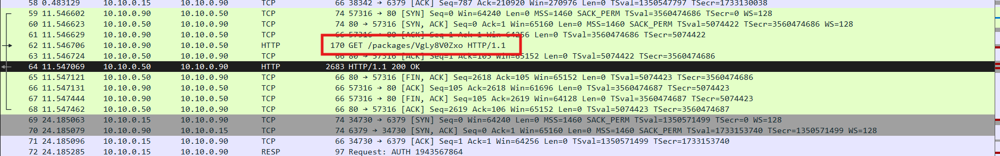

Khi mở TCP stream thì thấy nó đang thực hiện một bash script nhưng đang bị obfuscate.

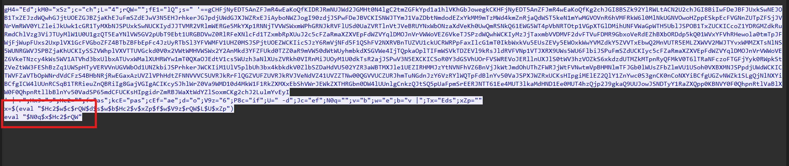

---

## 2. Gỡ lớp bash obfuscate đầu tiên

Deobfuscate bằng cách chạy thẳng các biến nhưng không thực hiện `eval`, thay vào đó chỉ `echo` để xem nội dung thật.

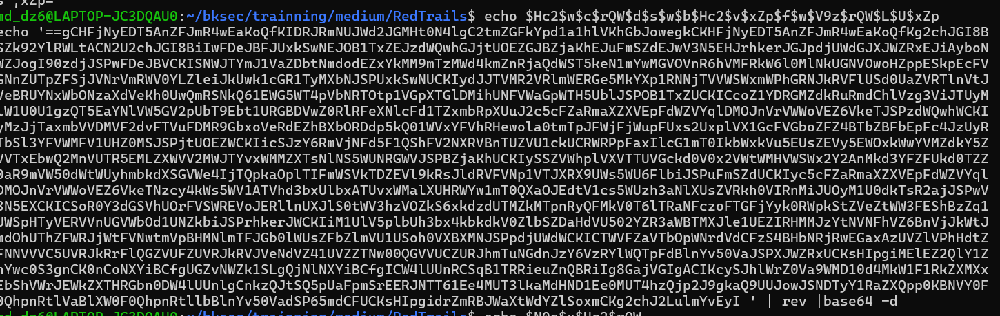

Vậy là đoạn script đang đảo ngược chuỗi rồi decode base64 sau đó lưu vào biến `x`. Sau khi thực hiện đúng flow đó thì thu được đoạn bash bên trong.

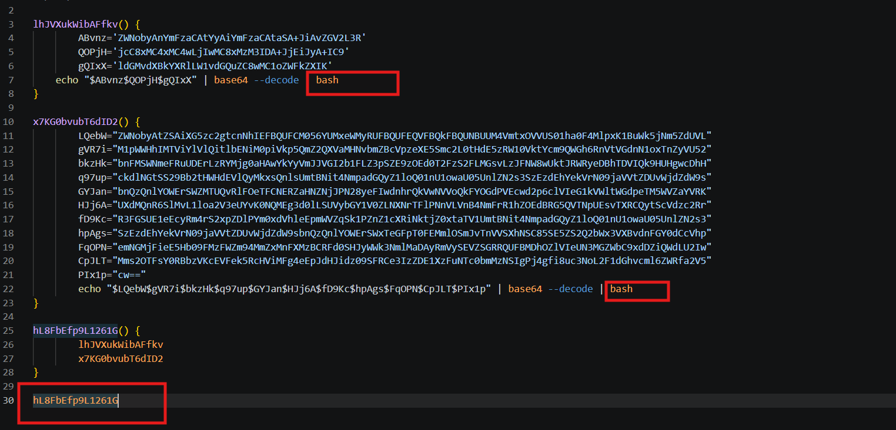

Hàm `hL8FbEfp9L1261G()` đang gọi 2 hàm:

- `lhJVXuKwiBAFfkv`
- `x7KG0bvubT6dID2`

Ở cuối mỗi hàm con này đều có ghép chuỗi base64, decode ra lệnh bash rồi thực thi trực tiếp bằng `bash`.

Để deobfuscate nhanh và an toàn, ta xóa 2 đoạn `| bash` ở cuối pipeline, hoặc thay bằng redirect ra file để chỉ lấy nội dung thật thay vì thực thi.

---

## 3. Phân tích payload bash thứ nhất

Từ đoạn base64 đầu sau khi decode:

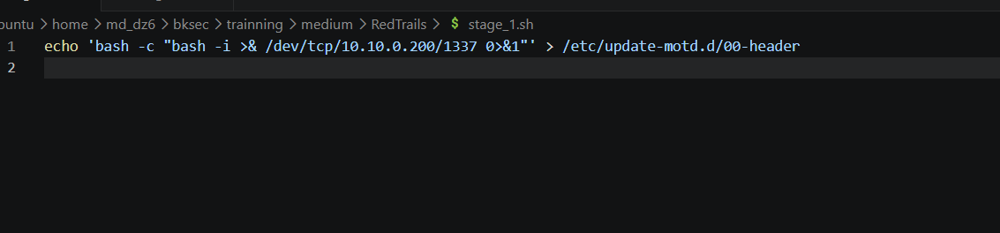

### Nhận xét

Payload sẽ tạo reverse shell bằng bash tới địa chỉ `10.10.0.200` port `1337`.

Vì `/etc/update-motd.d/00-header` là script thuộc cơ chế MOTD của Linux, khi MOTD được thực thi thì lệnh reverse shell có thể được kích hoạt lại. Đây cũng là một dạng persistence khá gọn.

---

## 4. Phân tích payload bash thứ hai

Từ đoạn base64 hai sau khi decode:

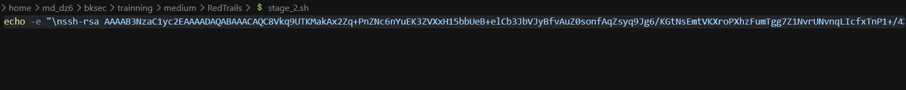

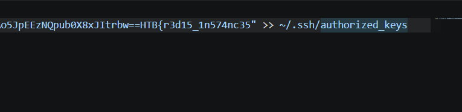

### Nhận xét

Script dùng `echo -e` để append một SSH public key vào file:

```text
~/.ssh/authorized_keys
```

Điều này cho phép attacker đăng nhập lại vào tài khoản hiện tại thông qua SSH bằng private key tương ứng, không cần mật khẩu.

Ở cuối SSH public key có phần comment chứa mảnh flag đầu tiên:

```text
HTB{r3d15_1n574nc35
```

---

## 5. Pivot sang lưu lượng Redis/RESP

Quay lại với file `pcap`, từ `Statistics -> Protocol Hierarchy`, thấy được phần lớn dữ liệu nằm ở **Redis Serialization Protocol**.

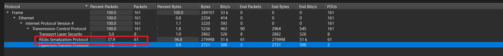

Sử dụng filter `resp` để lọc các gói Redis/RESP, rồi vào TCP Stream để xem trực tiếp các command Redis mà attacker đã gửi.

Thấy được ở gần cuối có các lệnh thao tác với key `users_table` như:

- `KEYS *`
- `TYPE users_table`
- `HGETALL users_table`

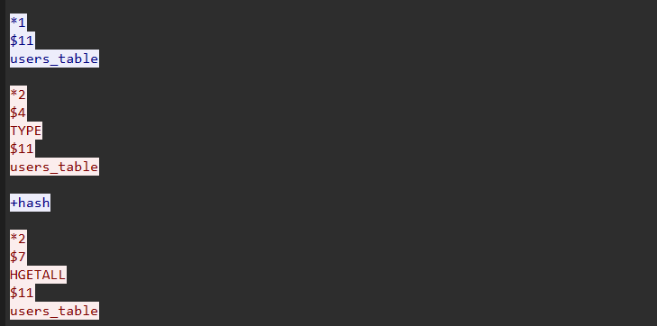

Cuối cùng thu được:

```text
FLAG_PART:_c0uld_0p3n_n3w
```

đây là mảnh 2 của flag.

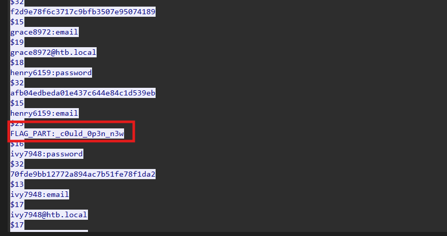

---

## 6. Phát hiện attacker load Redis module

Ngoài các lệnh dump dữ liệu từ `users_table`, khi lướt xuống cuối cùng thấy được hành vi load module Redis.

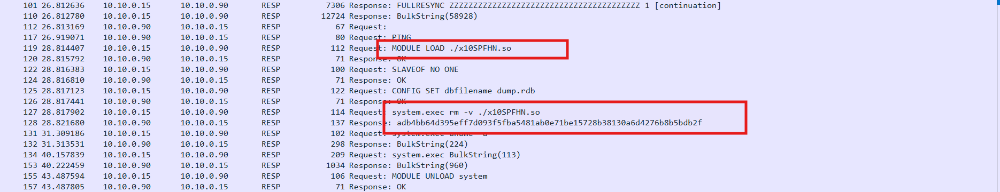

Trong đó attacker đã dùng:

```text
MODULE LOAD ./x10SPFHN.so
```

để nạp module này.

Sau khi module được load thành công, Redis xuất hiện command `system.exec`. Attacker tiếp tục dùng `system.exec` để chạy lệnh hệ thống, ví dụ xóa file module `./x10SPFHN.so` để xóa dấu vết và thực thi các command khác trên máy nạn nhân.

Sử dụng filter để tìm các packet có chứa chuỗi `system.exec`.

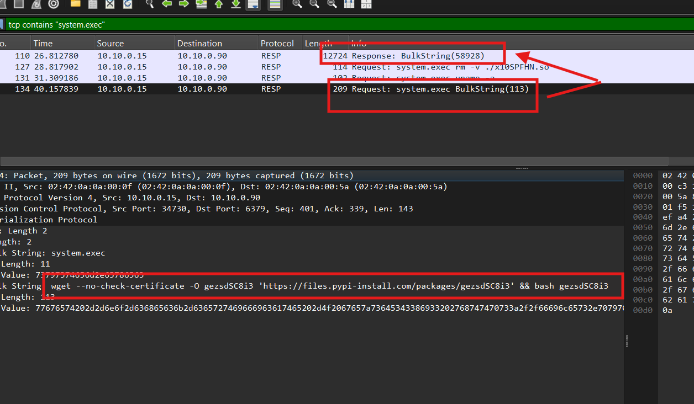

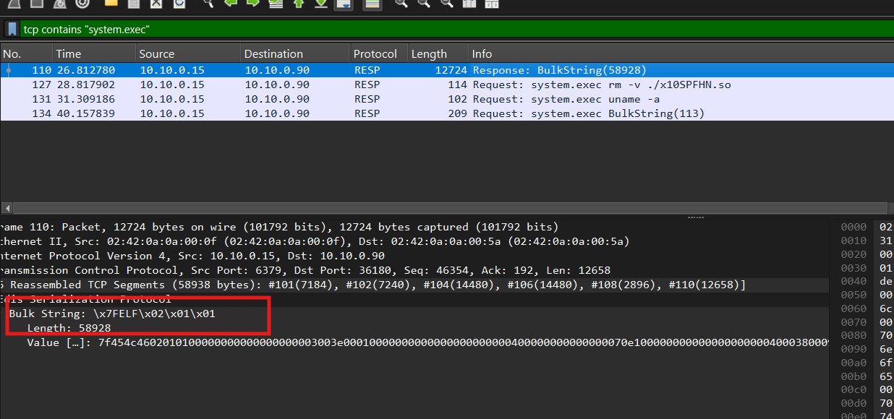

Chú ý hơn vào các request và response này, có thể thấy request đang cố gắng tải payload `gezsdSC8i3` từ `files.pypi-install.com` rồi thực thi bằng bash thông qua `system.exec`.

Và trong response `BulkString(58928)` có dữ liệu bắt đầu bằng `\x7fELF`, cho thấy đây là một file ELF. File này chính là Redis module `x10SPFHN.so` được attacker đẩy vào Redis thông qua quá trình replication, sau đó được load bằng `MODULE LOAD` để tạo ra command `system.exec`.

Giờ export file này ra.

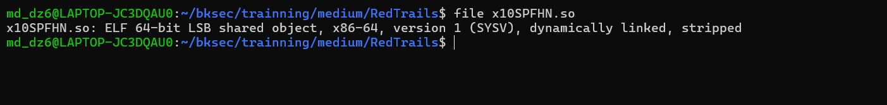

---

## 7. Phân tích module `x10SPFHN.so`

Mở file bằng Ghidra để phân tích.

Từ hàm `DoCommand` trong module `x10SPFHN.so`, ta thấy module không trả output `system.exec` trực tiếp dưới dạng plaintext.

Sau khi chạy command bằng `popen()`, module lấy output rồi mã hóa lại trước khi trả về Redis. Trong phần mã hóa có các chi tiết quan trọng:

- `local_1098 = "h02B6aVgu09Kzu9QTvTOtgx9oER9WIoz"`
- `local_1090 = "YDP7ECjzuV7sagMN"`
- `cipher = EVP_aes_256_cbc()`
- `EVP_EncryptInit_ex(...)`
- `EVP_EncryptUpdate(...)`
- `EVP_EncryptFinal_ex(...)`

Điều này chứng minh response của `system.exec` được mã hóa bằng **AES-256-CBC**. Chuỗi `h02B6aVgu09Kzu9QTvTOtgx9oER9WIoz` dài 32 bytes nên được dùng làm **AES-256 key**, còn `YDP7ECjzuV7sagMN` dài 16 bytes nên được dùng làm **IV**.

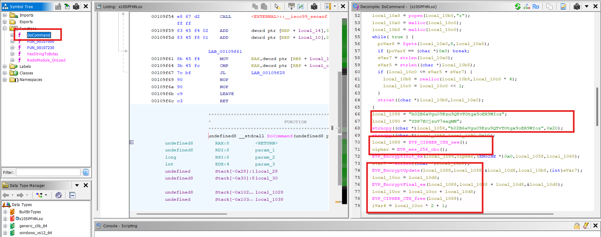

Đồng thời còn có 1 hàm:

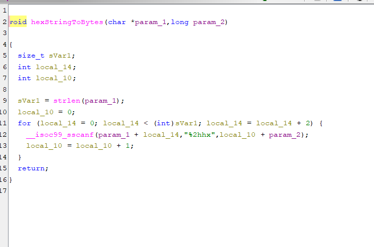

Hàm `hexStringToBytes` có nhiệm vụ chuyển chuỗi hex thành dữ liệu bytes thật. Hàm duyệt chuỗi input theo từng cặp 2 ký tự và dùng `sscanf` với format `%2hhx` để parse mỗi cặp hex thành một byte.

Vì response của `system.exec` trong Redis stream được trả về dưới dạng chuỗi hex, nên trước khi decrypt AES-256-CBC, ta phải convert chuỗi hex này về bytes, rồi mới đưa vào hàm decrypt.

---

## 8. Decrypt output của `system.exec`

Vậy sau khi có được key và IV hardcode trong module `x10SPFHN.so`, có thể decrypt output của lệnh `system.exec` đang tải về bằng `wget`.

Sử dụng CyberChef để decrypt với:

Input chuỗi hex từ response của lệnh `wget`:

```text
394810bbd00d01baa64e1da65ad18dcbe7d1ca585d429847e0fe1c4f76ff3cf49fcc4943e9dd339c5cbac2fd876c21d37b4ea3c014fe679f81cd9a546a7a324c6958b87785237671b3331ae9a54d126f78c916de74c154a1915a963edffdb357af5d7cfdb85b200fdeb35f4f508367081e31e3094c15e2a683865bb05b04a36b19202ab49c5ebffcec7698d5f2e344c5d9da608c5c2506c689c1fc4a492bec4dd4db33becb17d631c0fdd7e642c20ffa7e987d2851c532e77bdfb094c0cfcd228499c57ea257f305c367b813bc4d4cf937136e02398ce7cb3c26f16f3c6fc22a2b43795d41260b46d8bdf0432aaefbcc863880571952510bf3d98919219ab49e86974f11a81fff5ff85734601e79c2c2d754e3fe7a6cfcec8349ceb350ea7145f87b86f7e65543268c8ae76cb54bef1885b01b222841da59a377140ae6bd544cc47ac550a865af84f5b31df6a21e7816ed163260f47ea16a64f153be1399911a99fd71b30689b961477db551c9bc2cdc1aa6b931ba2852af1e297ee66fb99381ab916b377358243152f1f3abba9f7ad700ba873b53dc2f98642f47580d7ef5d3e3b32b3c4a9a53689c68a5911a6258f2da92ca30661ebef77109e1e44f3aa6665f6734af7d3d721201e3d31c61d4da562cef34f66dd7f88fb639b2aaf4444952
```

Key:

```text
h02B6aVgu09Kzu9QTvTOtgx9oER9WIoz
```

IV:

```text
YDP7ECjzuV7sagMN
```

Mode:

```text
CBC
```

Cuối cùng thu được mảnh cuối của flag là:

```text
_un3xp3c73d_7r41l5!}
```

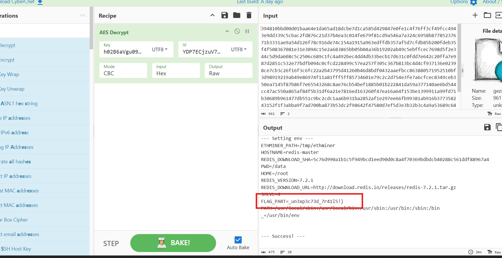

---

## 9. Flag

Vậy flag là:

```text
HTB{r3d15_1n574nc35_c0uld_0p3n_n3w_un3xp3c73d_7r41l5!}
```

---

## 10. Flow

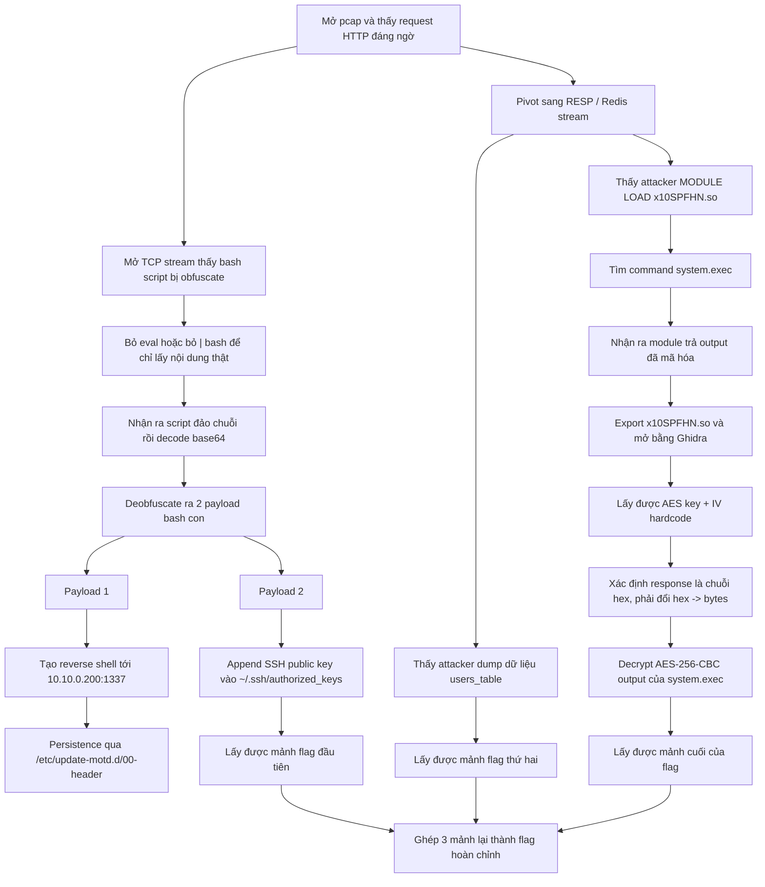
