# Challenge Rogue

## 1. Đầu vào challenge

Đầu vào challenge cung cấp file `pcap`.

Từ **Statistics → Protocol Hierarchy** thấy được lưu lượng FTP/FTP Data xuất hiện khá nhiều, đặc biệt FTP Data chiếm phần lớn dung lượng traffic.

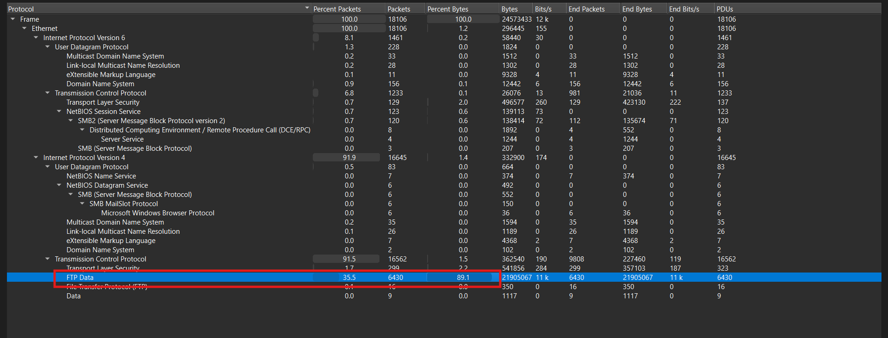

Sử dụng filter:

```text
ftp
```

để kiểm tra các lệnh FTP control, thấy được client `192.168.1.14` đăng nhập FTP bằng user `ftpuser`, password `SZC0aBomFG`, sau đó upload file `3858793632.zip` lên server `77.74.198.52` bằng lệnh `STOR`.

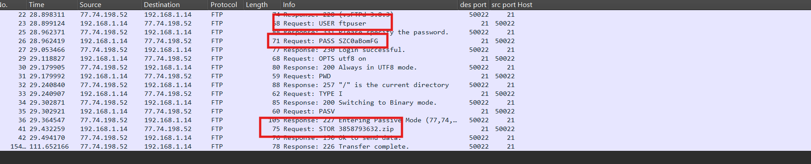

### Kiến thức ngoài lề

FTP là viết tắt của **File Transfer Protocol** — giao thức dùng để truyền file qua mạng.

Một số lệnh FTP cơ bản hay gặp:

- `USER`: nhập username
- `PASS`: nhập password
- `PASV`: chuyển sang passive mode để truyền dữ liệu
- `STOR`: upload file lên server
- `RETR`: tải file từ server về client
- `LIST`: liệt kê file/thư mục

SMB là một giao thức mạng được sử dụng chủ yếu trong hệ điều hành Windows để chia sẻ file, thư mục, và các thiết bị ngoại vi giữa các máy tính trong cùng một mạng.

- **Chức năng:** cho phép các máy khách (client) yêu cầu file hoặc dịch vụ từ máy chủ (server)
- **Mô hình hoạt động:** client-server

NTLMSSP là một **cơ chế xác thực** dựa trên NTLM. Nó được sử dụng để xác minh danh tính người dùng khi họ cố gắng kết nối và sử dụng các tài nguyên được chia sẻ qua SMB.

- **Cách hoạt động:** NTLM sử dụng quy trình *challenge/response* để xác thực mà không gửi mật khẩu thực tế qua mạng
- **Tác dụng:** khi truy cập một thư mục dùng chung trên máy khác, NTLMSSP đảm bảo người dùng có quyền truy cập hay không

Trong môi trường mạng Windows, khi một người dùng truy cập tài nguyên mạng:

- **SMB** được dùng làm phương tiện truyền tải yêu cầu
- **NTLMSSP** được dùng để xác thực người dùng đó (nếu không sử dụng Kerberos)

---

## 2. Export file từ FTP và xác định dump LSASS

Export file zip đó ra ngoài, sau đó extract thì thu được file `3858793632.pmd`.

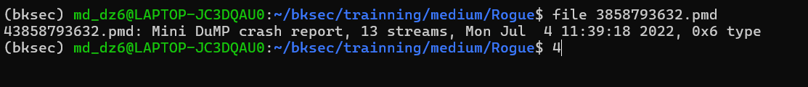

File `3858793632.pmd` là file dump bộ nhớ của một tiến trình trên Windows.

Sử dụng **VirusTotal** để check thì thấy được file này bị gắn nhãn liên quan tới **`lsass/mdump`**. Một số engine cũng nhận diện đây là **LSASS MiniDump** hoặc **Minidump generated from lsass.exe**.

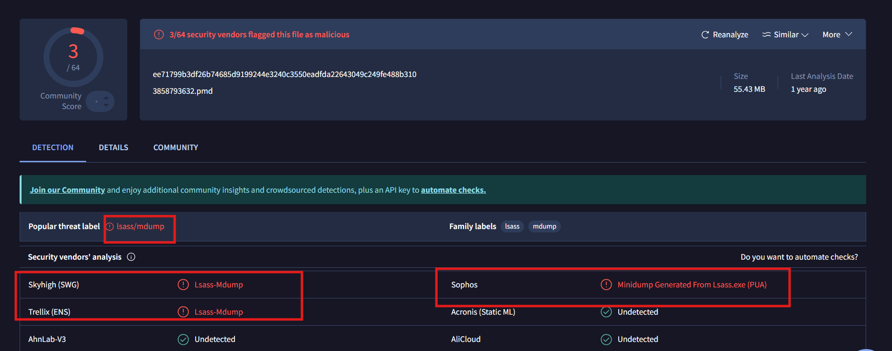

Từ đây có thể suy ra file `3858793632.pmd` nhiều khả năng là dump bộ nhớ của tiến trình `lsass.exe`. Đây là tiến trình Windows xử lý xác thực đăng nhập, nên trong dump có thể chứa credential hoặc NTLM hash của user.

---

## 3. Parse credential từ LSASS dump

Sử dụng `pypykatz` để parse credential trong dump:

```bash
pypykatz lsa minidump 3858793632.pmd
```

Kết quả cho thấy trong dump có nhiều logon session.

Các credential đáng chú ý gồm:

- `WS02\rpaker`
- `CORP\rpaker`
- `CORP\athomson`
- `CORP\WS02$`

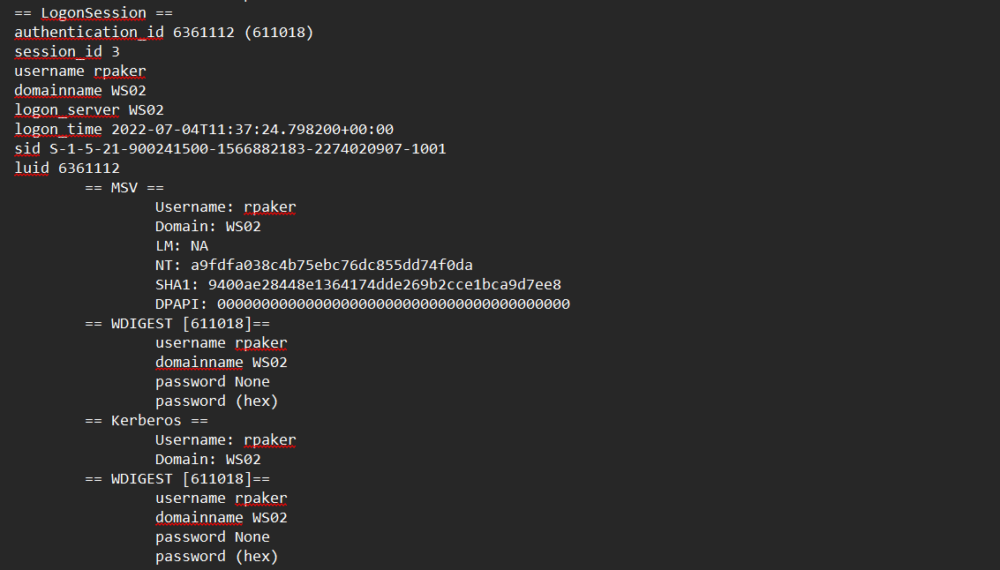

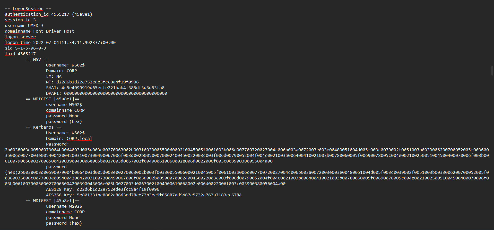

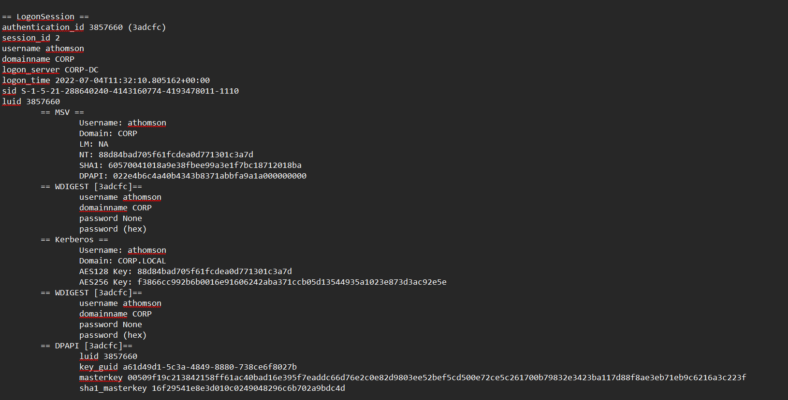

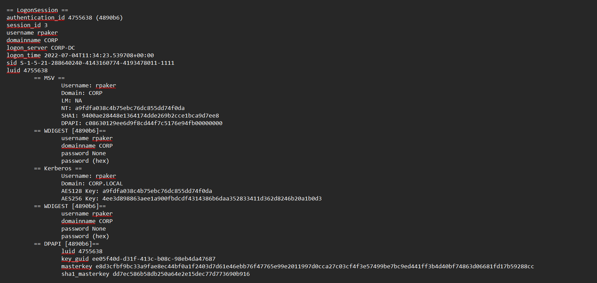

### Giải thích

- `LogonSession`: một phiên đăng nhập được tìm thấy trong LSASS dump
- `authentication_id`: ID định danh phiên đăng nhập trong Windows
- `session_id`: ID session của user trên máy, ví dụ session console/RDP
- `username`: tên user trong phiên đăng nhập
- `domainname`: domain hoặc hostname mà user thuộc về, ví dụ `CORP` hoặc `WS02`
- `logon_server`: máy/server xử lý việc xác thực đăng nhập, ví dụ `CORP-DC`
- `logon_time`: thời điểm user đăng nhập
- `sid`: Security Identifier, mã định danh duy nhất của user/account trong Windows
- `luid`: Locally Unique Identifier, ID nội bộ của phiên đăng nhập trên máy
- `MSV`: phần chứa thông tin xác thực NTLM
- `Username`: user tương ứng trong credential
- `Domain`: domain/máy của user
- `NT`: NT hash của user, đây là trường quan trọng nhất trong bài
- `SHA1`: hash SHA1 liên quan đến credential
- `DPAPI`: key/material liên quan đến DPAPI nếu có
- `Kerberos`: chứa thông tin/key Kerberos của user trong domain
- `AES128 Key` / `AES256 Key`: key Kerberos tương ứng
- `DPAPI key_guid`, `masterkey`, `sha1_masterkey`: thông tin dùng cho giải mã dữ liệu được bảo vệ bởi DPAPI

Quay lại PCAP để xem phiên SMB/NTLMSSP đang authenticate bằng user nào.

---

## 4. Xác định user đang authenticate cho phiên SMB

Giờ quay lại PCAP và kiểm tra phiên SMB/NTLMSSP đang được authenticate bằng user nào.

Sử dụng filter:

```text
ntlmssp
```

để kiểm tra các phiên SMB xác thực bằng NTLMSSP. Thấy trong các gói `Session Setup Request` có user:

```text
CORP\athomson
```

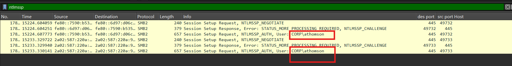

Vậy SMB encrypted đang authenticate bằng user `CORP\athomson`.

Theo tài liệu **MS-NLMP 3.3.2 NTLM v2 Authentication**, cách NTLMv2 tạo `SessionBaseKey` là từ `ResponseKeyNT` và `NTProofStr`.

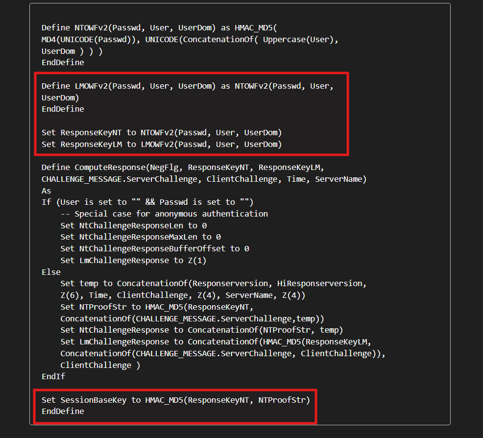

Và trong **MS-NLMP 3.2.5.1.2 Server Receives an AUTHENTICATE_MESSAGE from the Client** cho biết: nếu flag `NTLMSSP_NEGOTIATE_KEY_EXCH` được bật, `ExportedSessionKey` sẽ được tính bằng cách dùng `RC4K` với `KeyExchangeKey` để xử lý `AUTHENTICATE_MESSAGE.EncryptedRandomSessionKey`.

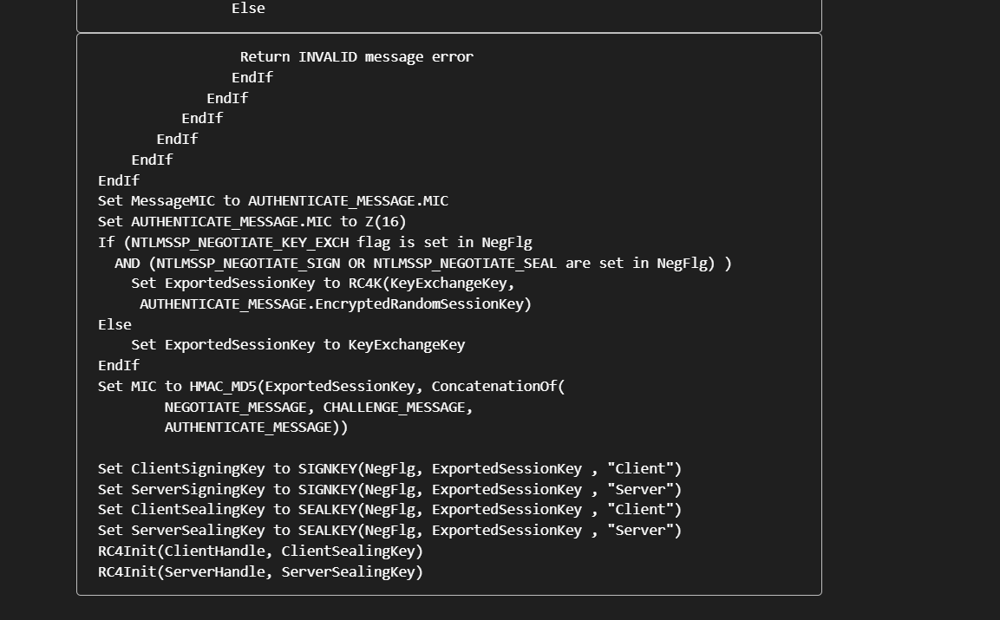

Tiếp tục trong **MS-SMB2 3.3.5.5.3 Handling a New Authentication**, tài liệu cho biết sau khi authentication thành công, `Session.SessionKey` của SMB được set từ cryptographic key lấy ra từ authenticated security context. Trong case này, security context là phiên NTLMSSP, nên key mà NTLMSSP export ra sẽ là thứ SMB dùng để thiết lập session key.

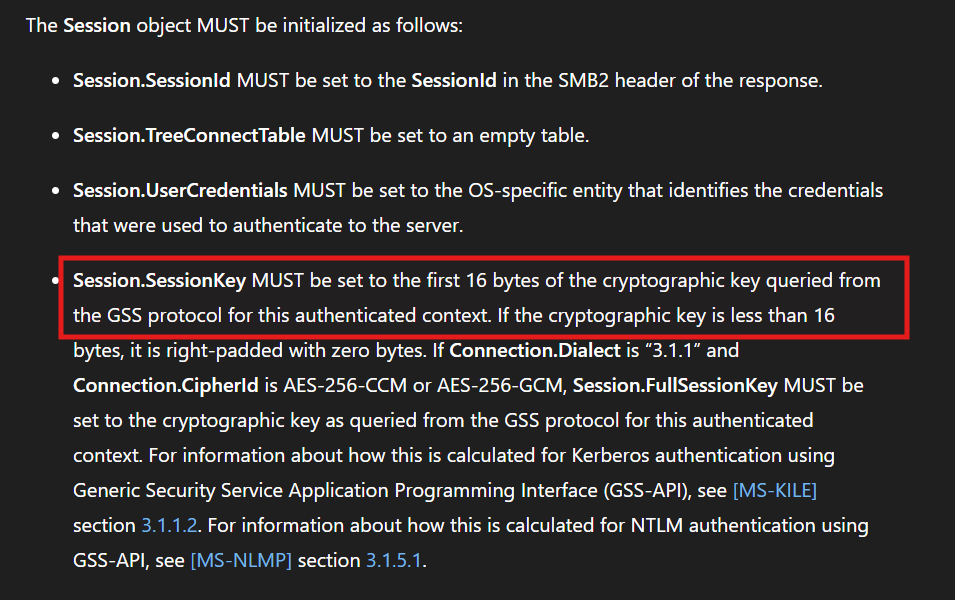

Sau đó, ở phần **MS-SMB2 3.1.4.3 Encrypting the Message**, SMB3 sử dụng `Session.EncryptionKey` để mã hóa message. Vì vậy muốn decrypt SMB encrypted traffic, ta cần khôi phục đúng session key của phiên SMB này.

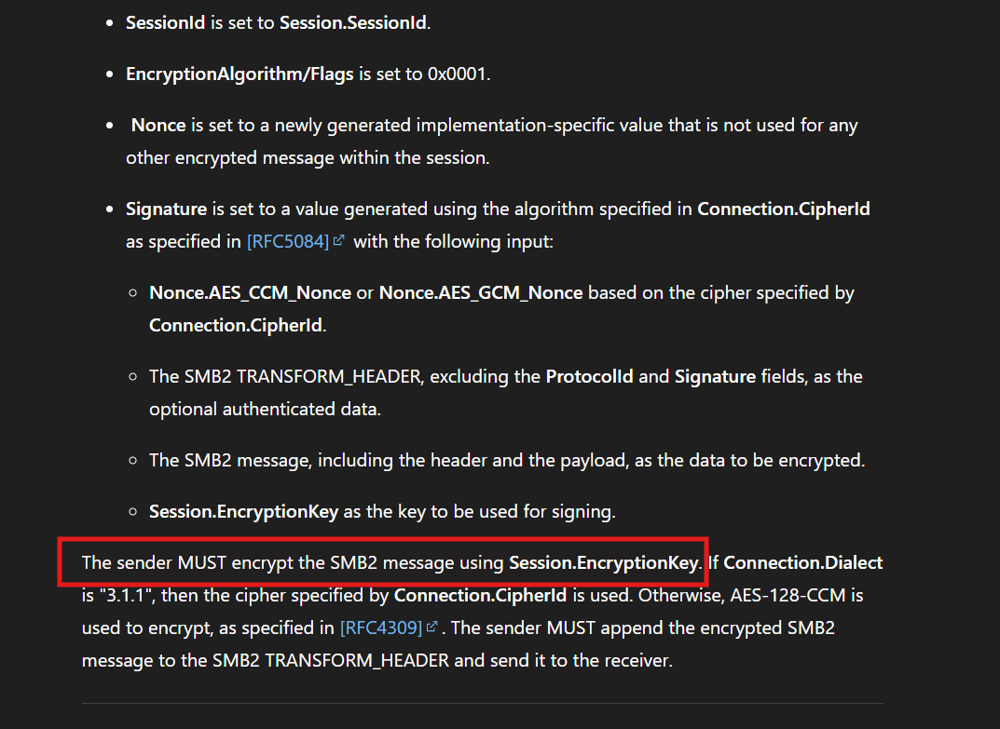

---

## 5. Flow xác định các thành phần để decrypt SMB encrypted message


---

## 6. Lấy các giá trị cần thiết từ traffic và LSASS dump

Xác định được `SessionId` là:

```text
0x0000a00000000015
```

từ các gói `Session Setup Request`.

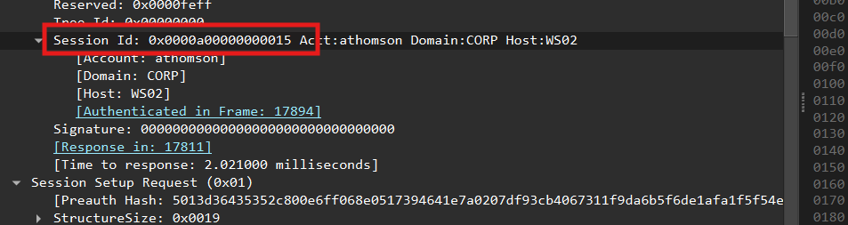

Từ các bước trước cũng đã lấy được:

```text
user/domain = CORP\athomson
NT hash = 88d84bad705f61fcdea0d771301c3a7d
```

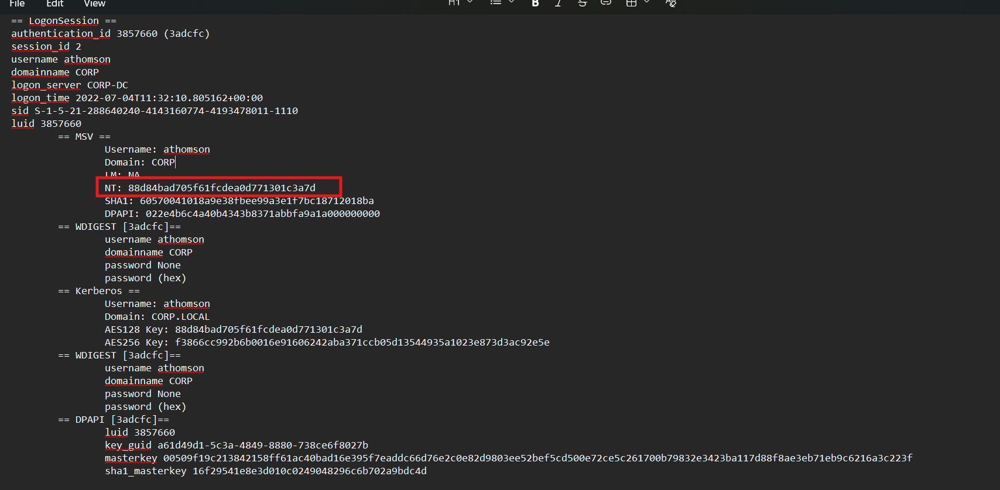

Tiếp tục từ các gói `Session Setup Request` trong phần `NTLMSSP_AUTH`, lấy được `NTProofStr` trong `NTLMv2 Response`.

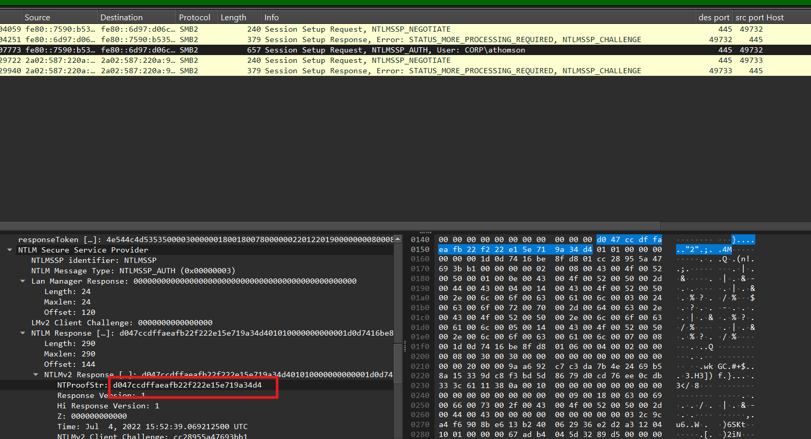

Tiếp tục trong NTLM Response tìm được `Encrypted Random Session Key` là:

```text
032c9ca4f6908be613b240062936e2d2
```

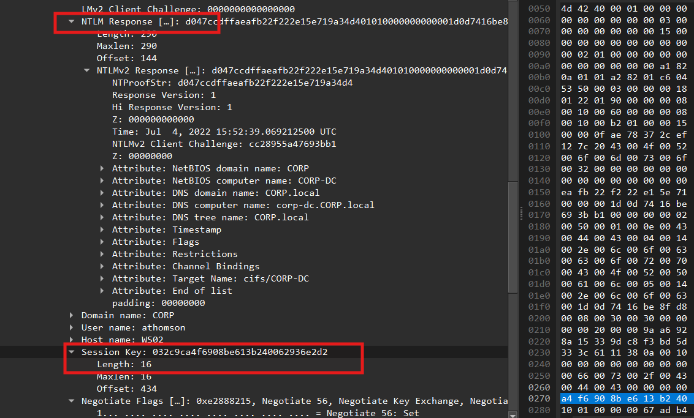

Đồng thời phần `Negotiate Flags` có flag **Negotiate Key Exchange**. Điều này cho biết NTLMSSP có bật `KEY_EXCH`, nên không thể dùng trực tiếp `SessionBaseKey` làm session key cuối cùng. Thay vào đó, cần dùng RC4 với `KeyExchangeKey` để giải `Encrypted Random Session Key`, từ đó thu được `ExportedSessionKey`.

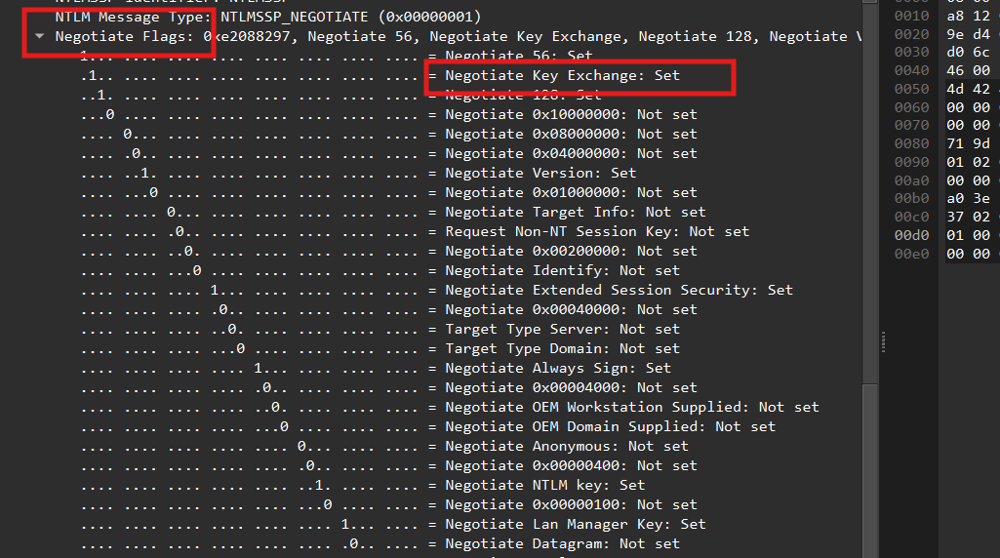

Vậy lúc này đã có đủ các giá trị cần thiết gồm:

- `user/domain`
- `NT hash`
- `NTProofStr`
- `Encrypted Random Session Key`
- xác nhận `Negotiate Key Exchange` đã được bật

---

## 7. Tính ExportedSessionKey / SMB Session Key

Từ các giá trị này, sử dụng script để tính `ExportedSessionKey`, tức SMB Session Key cần dùng để decrypt SMB encrypted traffic trong Wireshark.

```python
#!/usr/bin/env python3
import hmac
import hashlib
from Crypto.Cipher import ARC4

username = "athomson"
domain = "CORP"
nt_hash_hex = "88d84bad705f61fcdea0d771301c3a7d"
ntproofstr_hex = "d047ccdffaeafb22f222e15e719a34d4"
encrypted_random_session_key_hex = "032c9ca4f6908be613b240062936e2d2"

nt_hash = bytes.fromhex(nt_hash_hex)
ntproofstr = bytes.fromhex(ntproofstr_hex)
encrypted_random_session_key = bytes.fromhex(encrypted_random_session_key_hex)

# ResponseKeyNT = HMAC-MD5(NT_hash, UTF-16LE(UPPER(username) + domain))
identity = (username.upper() + domain).encode("utf-16le")
response_key_nt = hmac.new(nt_hash, identity, hashlib.md5).digest()

# SessionBaseKey = HMAC-MD5(ResponseKeyNT, NTProofStr)
session_base_key = hmac.new(response_key_nt, ntproofstr, hashlib.md5).digest()

# Vì KEY_EXCH bật:
# ExportedSessionKey = RC4K(SessionBaseKey, EncryptedRandomSessionKey)
exported_session_key = ARC4.new(session_base_key).decrypt(encrypted_random_session_key)

print("ResponseKeyNT     :", response_key_nt.hex())
print("SessionBaseKey    :", session_base_key.hex())
print("SMB Session Key   :", exported_session_key.hex())
```

Cuối cùng thu được:

```text
ResponseKeyNT     : 6bc1c5e3a6a4aba16139faad9a3cce6e
SessionBaseKey    : 4765b4b66d2d5de5b323708a33d33318
SMB Session Key   : 9ae0af5c19ba0de2ddbe70881d4263ac
```

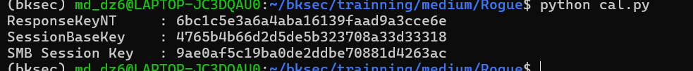

### Mermaid 2 — Flow tính SMB Session Key

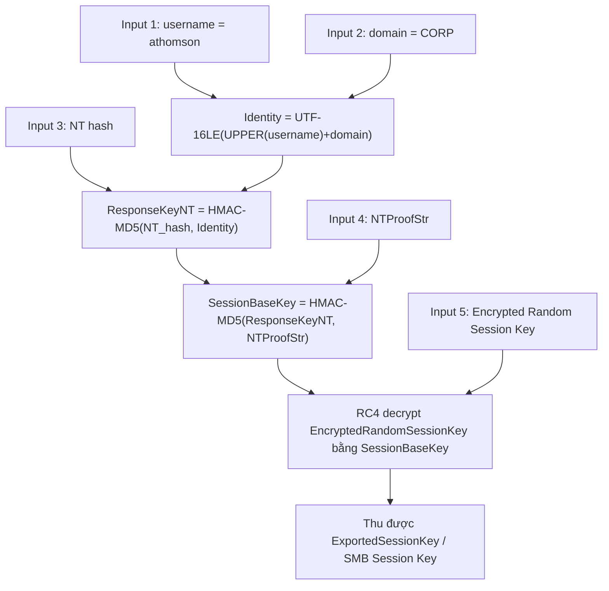
```mermaid
flowchart TD
    A["Input 1: username = athomson"]
    B["Input 2: domain = CORP"]
    C["Input 3: NT hash"]
    D["Input 4: NTProofStr"]
    E["Input 5: Encrypted Random Session Key"]

    F["Identity = UTF-16LE(UPPER(username)+domain)"]
    G["ResponseKeyNT = HMAC-MD5(NT_hash, Identity)"]
    H["SessionBaseKey = HMAC-MD5(ResponseKeyNT, NTProofStr)"]
    I["RC4 decrypt EncryptedRandomSessionKey bằng SessionBaseKey"]
    J["Thu được ExportedSessionKey / SMB Session Key"]

    A --> F
    B --> F
    C --> G
    F --> G
    G --> H
    D --> H
    H --> I
    E --> I
    I --> J
```

---

## 8. Đưa Session ID và Session Key vào Wireshark

Do đã xác định từ trước `Session ID` là `0x0000a00000000015`, và cũng vừa tính được `SMB Session Key` là:

```text
9ae0af5c19ba0de2ddbe70881d4263ac
```

ta nhập hai giá trị này vào phần SMB2 decryption của Wireshark.

Vào:

```text
Edit → Preferences → Protocols → SMB2
```

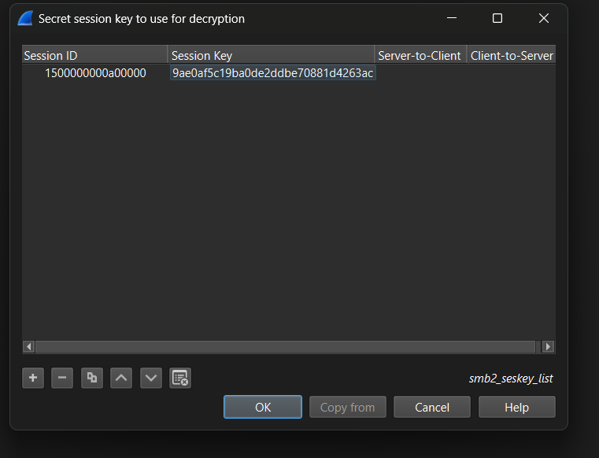

Sau khi apply `Session ID` và `SMB Session Key` vào SMB2 preferences của Wireshark, sử dụng filter:

```text
smb2
```

Lúc này các request/response SMB không còn chỉ là encrypted data nữa, mà đã thấy rõ các thao tác như `Create Request`, `Read Request`, `Read Response`, `GetInfo Request`.

Quan sát các packet đã decrypt, ta thấy client truy cập và đọc file:

```text
customer_information.pdf
```

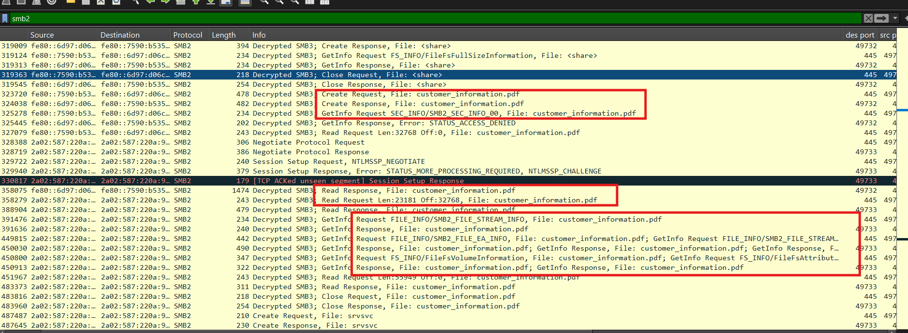

---

## 9. Flag

Export file này ra xem thử thì thu được flag:

```text
HTB{n0th1ng_c4n_st4y_un3ncrypt3d_f0r3v3r}
```

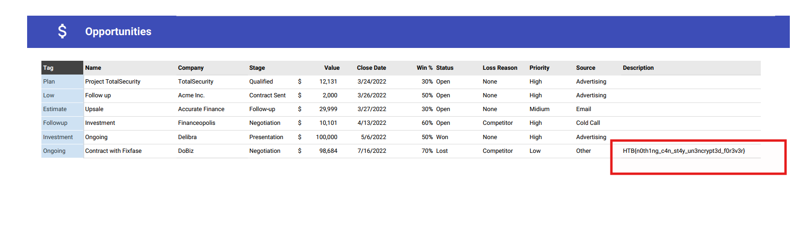

---
