# Challenge Seized

## 1. Đầu vào challenge

Challenge cung cấp 1 folder `AppData`, đồng thời đề bài còn nhắc tới **credentials for the Ransomware’s Dashboard**. Khi tìm các file kiểu cache, `ConsoleHost_history.txt` không thấy gì đáng chú ý, nên hướng nghi ngờ hợp lý nhất là **credential được lưu trong trình duyệt**, đặc biệt là **Chrome Saved Passwords**.


Từ file:

```text
AppData/Local/Google/Chrome/User Data/Default/Login Data
```

thấy có bảng `logins`.

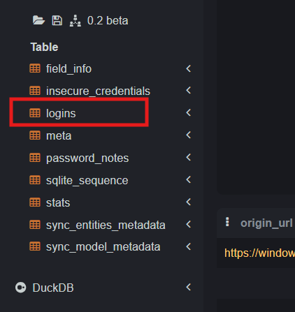

Query để lấy `username_value` và `password_value`.

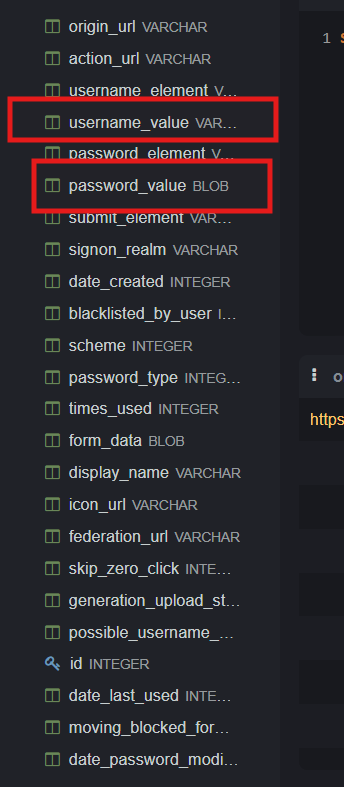
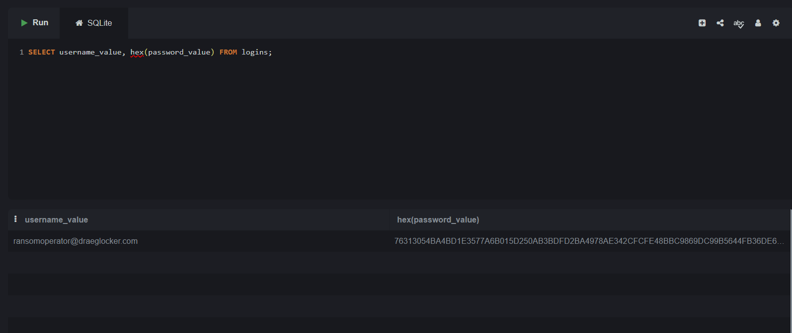

Từ `password_value`, có thể biết được **Chrome đang dùng format mã hóa `v10`** vì sau khi decode hex sang bytes, phần đầu của blob hiện ra chuỗi `v10`.

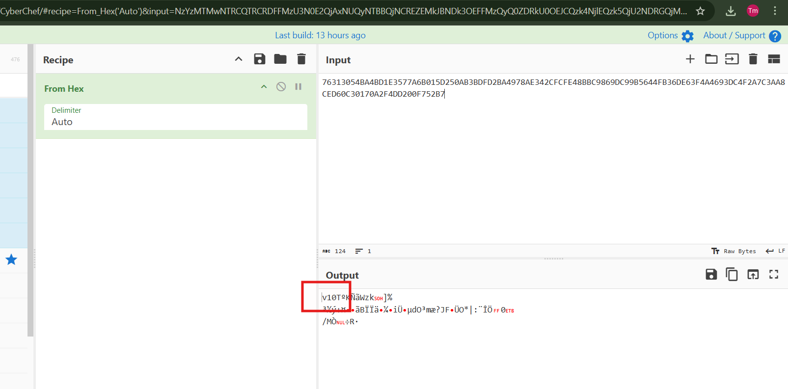

Đồng thời từ file:

```text
AppData/Local/Google/Chrome/User Data/Last Version
```

cũng biết được version Chrome đang dùng hiện tại là `101.0.4951.67`.

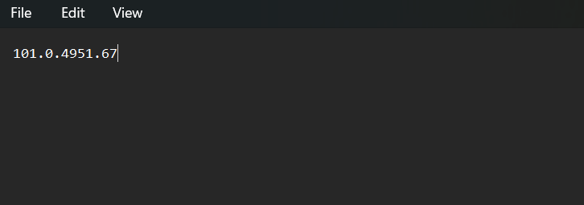

---

## 2. Flow mã hóa/giải mã của Chrome ở version này

Sau khi tìm hiểu flow từ source Chromium:

[Source Chromium](https://chromium.googlesource.com/chromium/src/%2B/112.0.5615.165/components/os_crypt/os_crypt_win.cc)

Theo source `os_crypt_win.cc`, Chrome định nghĩa vị trí lưu master key bằng biến:

```text
kOsCryptEncryptedKeyPrefName = "os_crypt.encrypted_key"
```

Nghĩa là Chrome sẽ đọc file `Local State` và tìm trường `os_crypt.encrypted_key`. Giá trị này không phải key plaintext, mà là key đã được base64 encode và được Windows DPAPI bảo vệ.

Trong hàm `InitWithExistingKey()`, Chrome lấy key cũ bằng cách đọc `base64_encrypted_key`, sau đó gọi:

```text
Base64Decode(base64_encrypted_key, &encrypted_key_with_header)
```

Sau khi decode, Chrome kiểm tra dữ liệu có prefix `DPAPI` bằng:

```text
StartsWith(encrypted_key_with_header, kDPAPIKeyPrefix)
```

Nếu đúng, Chrome bỏ prefix này bằng:

```text
substr(sizeof(kDPAPIKeyPrefix) - 1)
```

Sau đó Chrome gọi:

```text
DecryptStringWithDPAPI(encrypted_key, &key)
```

Bên trong hàm này là Windows API:

```text
CryptUnprotectData(...)
```

Kết quả của bước này là lấy được **Chrome master key**.

Tiếp theo, khi decrypt `password_value` trong `Login Data`, Chrome kiểm tra password blob có bắt đầu bằng `v10` hay không bằng:

```text
StartsWith(ciphertext, kEncryptionVersionPrefix)
```

Nếu không có `v10`, Chrome fallback sang decrypt trực tiếp bằng DPAPI. Nếu có `v10`, Chrome dùng cơ chế mới:

```text
crypto::Aead::AES_256_GCM
```

Lúc này `password_value` được parse theo format:

```text
v10 | nonce 12 bytes | ciphertext + tag
```

Nonce được lấy bằng đoạn code:

```text
ciphertext.substr(sizeof(kEncryptionVersionPrefix) - 1, kNonceLength)
```

Phần ciphertext còn lại được lấy bằng:

```text
ciphertext.substr(kNonceLength + sizeof("v10") - 1)
```

Cuối cùng Chrome gọi:

```text
aead.Open(raw_ciphertext, nonce, ..., plaintext)
```

để giải mã ra password thật.

### Flow encrypt Chrome v10

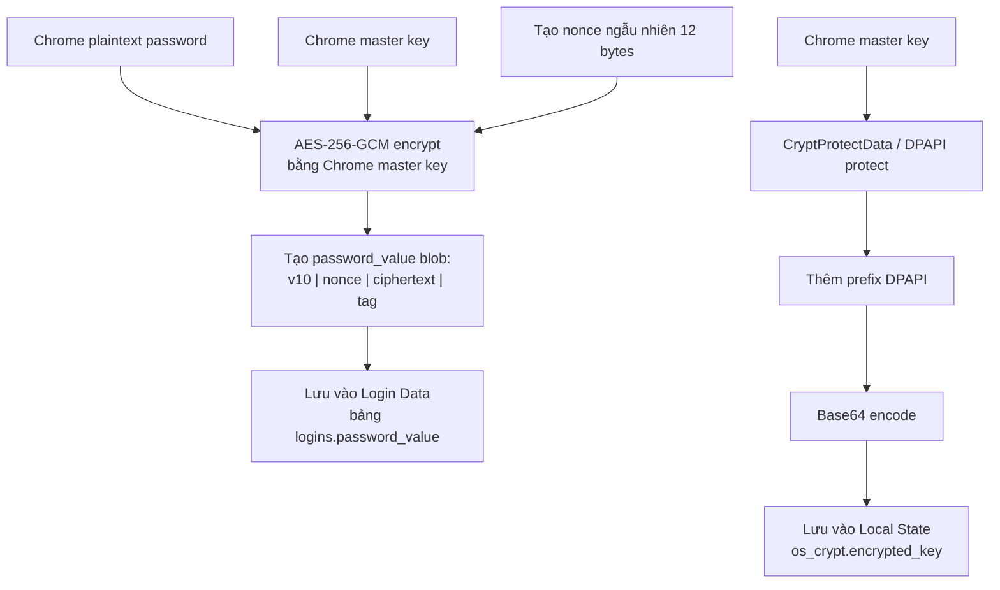

### Flow decrypt Chrome v10

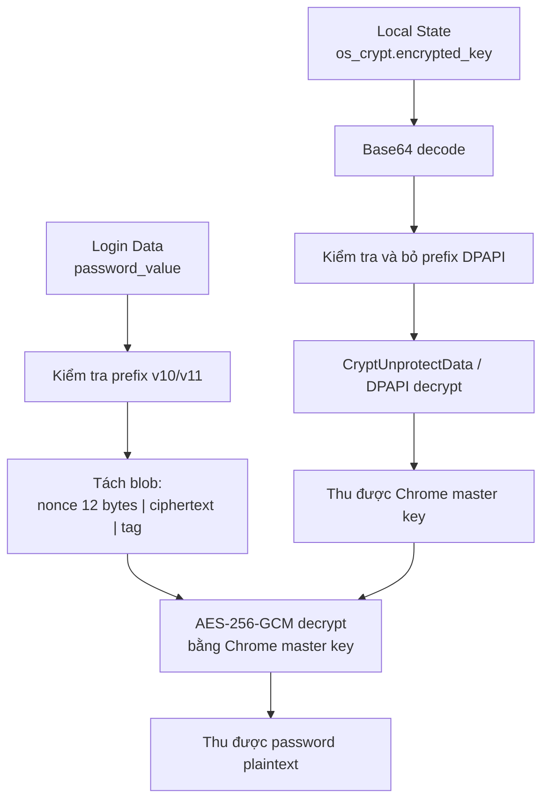

---

## 3. Online decrypt

Vì trong challenge này `password_value` bắt đầu bằng `v10` nên flow decrypt password cần có **Chrome master key**.

Theo source Chromium, với blob `v10`, Chrome không decrypt trực tiếp bằng DPAPI nữa, mà sẽ:

```text
Local State/os_crypt.encrypted_key
→ base64 decode
→ bỏ prefix DPAPI
→ DPAPI decrypt
→ Chrome master key
```
Mà khi tra cứu về DPAPI thì biết được user master key thường nằm trong:

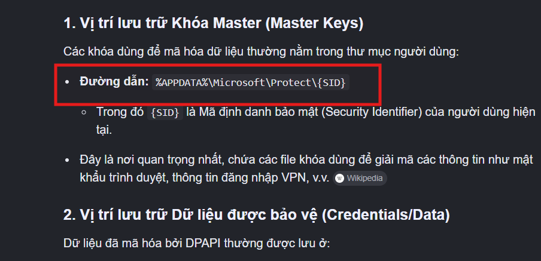

```text
AppData/Roaming/Microsoft/Protect/<SID>/<GUID>
```

Tức nếu đây là máy windows của user gốc đang đăng nhập, thì flow sẽ đơn giản hơn nhiều như cách chrome thực hiện decrypt password.

---

## 4. Flow

Nhưng vì challenge là **AppData offline**, không phải profile Windows của user đang đăng nhập trên máy mình, nên không thể gọi DPAPI decrypt trực tiếp bằng `CryptUnprotectData`.

### Flow decrypt offline

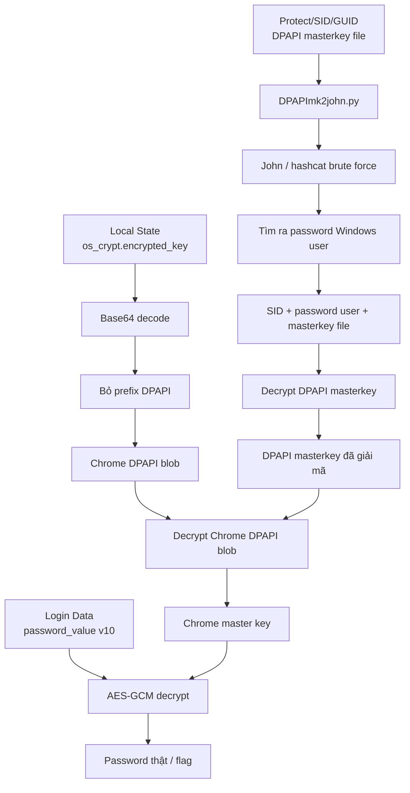

---

## 5. Lấy Chrome DPAPI blob và xác định SID + masterkey file

sử dụng script đọc file:

```text
AppData/Local/Google/Chrome/User Data/Local State
```

Sau đó lấy trường:

```text
os_crypt.encrypted_key
```

Giá trị này được Chrome lưu ở dạng base64. Script sẽ base64 decode, kiểm tra prefix `DPAPI`, bỏ prefix này và lưu phần còn lại ra file `chrome_key.dpapi`. Đây là **Chrome DPAPI blob**, chưa phải Chrome master key.

Đồng thời script cũng quét thư mục:

```text
AppData/Roaming/Microsoft/Protect/<SID>/
```

để tìm DPAPI masterkey file của user gốc. File này sẽ được dùng ở bước tiếp theo để tạo hash và brute force password Windows user.

```python
#!/usr/bin/env python3
import argparse, base64, json, re, shutil, sqlite3, tempfile
from pathlib import Path
from Crypto.Cipher import AES

GUID_RE = re.compile(r"^[0-9a-fA-F]{8}-[0-9a-fA-F]{4}-[0-9a-fA-F]{4}-[0-9a-fA-F]{4}-[0-9a-fA-F]{12}$")


def decrypt(blob, key):
    if not blob[:3] in (b"v10", b"v11") or len(blob) < 31:
        return None
    try:
        return AES.new(key, AES.MODE_GCM, nonce=blob[3:15]).decrypt_and_verify(blob[15:-16], blob[-16:]).decode("utf-8", errors="replace")
    except Exception:
        return None


def dump_passwords(appdata, key):
    for db in sorted((appdata / "Local/Google/Chrome/User Data").glob("*/Login Data")):
        with tempfile.TemporaryDirectory() as td:
            tmp = Path(td) / "db"
            shutil.copy2(db, tmp)
            con = sqlite3.connect(str(tmp))
            for url, user, blob in con.execute("SELECT origin_url, username_value, password_value FROM logins WHERE length(password_value) > 0"):
                pw = decrypt(blob, key)
                if pw:
                    print("=" * 70)
                    print(f"Profile : {db.parent.name}\nURL     : {url}\nUsername: {user}\nPassword: {pw}")
            con.close()


def prepare_dpapi(appdata, out_blob):
    local_state = appdata / "Local/Google/Chrome/User Data/Local State"
    raw = base64.b64decode(json.loads(local_state.read_text(encoding="utf-8"))["os_crypt"]["encrypted_key"])
    out_blob.write_bytes(raw[5:])

    protect = appdata / "Roaming/Microsoft/Protect"
    for sid_dir in protect.glob("S-*") if protect.exists() else []:
        for f in sid_dir.iterdir():
            if f.is_file() and GUID_RE.match(f.name):
                print(f"SID: {sid_dir.name} | MK: {f}")


def main():
    p = argparse.ArgumentParser()
    p.add_argument("--appdata", default="./AppData")
    p.add_argument("--out-blob", default="chrome_key.dpapi")
    p.add_argument("--chrome-master-key-hex")
    args = p.parse_args()

    appdata = Path(args.appdata).resolve()

    if args.chrome_master_key_hex:
        dump_passwords(appdata, bytes.fromhex(args.chrome_master_key_hex))
    else:
        prepare_dpapi(appdata, Path(args.out_blob).resolve())


if __name__ == "__main__":
    main()
```

SID của user gốc:

```text
S-1-5-21-3702016591-3723034727-1691771208-1002
```

DPAPI masterkey file:

```text
AppData/Roaming/Microsoft/Protect/S-1-5-21-3702016591-3723034727-1691771208-1002/865be7a6-863c-4d73-ac9f-233f8734089d
```
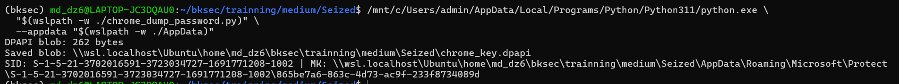

---

## 6. Brute force masterkey hash để lấy password Windows user

Sau khi đã có SID và DPAPI masterkey file, sử dụng `DPAPImk2john.py` để convert masterkey file sang hash John.

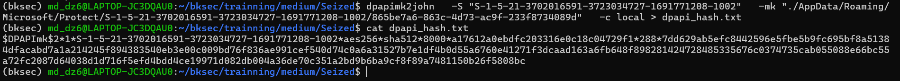

Sau đó dùng John Jumbo để brute force hash DPAPI masterkey. Cuối cùng thu được password Windows user là:

```text
ransom
```
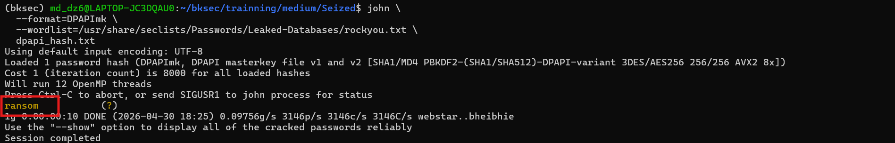

Tiếp tục sử dụng Impacket `dpapi.py` để decrypt DPAPI masterkey file bằng SID và password user vừa brute được.

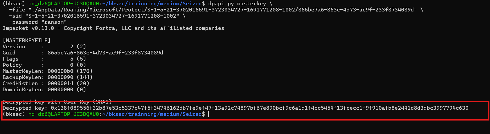

Cuối cùng thu được DPAPI masterkey đã giải mã để dùng decrypt Chrome DPAPI blob đã lưu ở file `chrome_key.dpapi`.

DPAPI masterkey:

```text
138f089556f32b87e53c5337c47f5f34746162db7fe9ef47f13a92c74897bf67e890bcf9c6a1d1f4cc5454f13fcecc1f9f910afb8e2441d8d3dbc3997794c630
```


### Kiến thức ngoài lề

`dpapi.py` là script command-line của Impacket dùng để parse/decrypt các cấu trúc DPAPI của Windows, ví dụ: masterkey, credential, vault, hoặc blob được bảo vệ bởi `CryptProtectData`.

Nó nhận DPAPI masterkey file rồi:

- parse cấu trúc `MASTERKEYFILE`
- đọc các thông tin như GUID, cipher, hash, rounds, salt, encrypted masterkey
- dùng SID + password user để derive key
- thử decrypt phần masterkey bị mã hoá
- verify đúng/sai bằng HMAC/checksum
- nếu đúng thì in ra `Decrypted key: 0x...`

---

## 7. Decrypt Chrome DPAPI blob và lấy Chrome master key

Giờ sử dụng DPAPI masterkey đã giải mã để decrypt Chrome DPAPI blob `chrome_key.dpapi` và thu được Chrome master key.

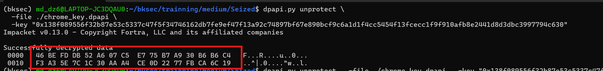

Chrome master key thu được:

```text
46befddb52a607c5e775b7a930b6b6c4f3a35e7c1c30aaa4ce0d2277fbca6c19
```

Đây là key AES dùng để decrypt các `password_value` dạng `v10` trong Chrome `Login Data`.

Cuối cùng sử dụng lại script ban đầu, truyền vào Chrome master key và decrypt Chrome `Login Data`. 

Password / Flag:

```text
HTB{Br0ws3rs_C4nt_s4v3_y0u_n0w}
```
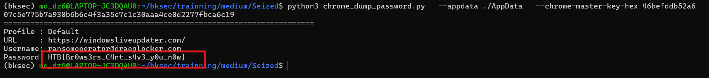

---

