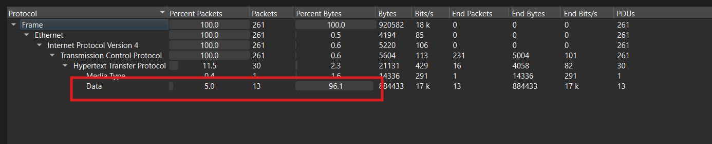
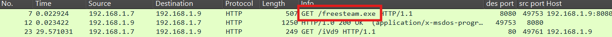
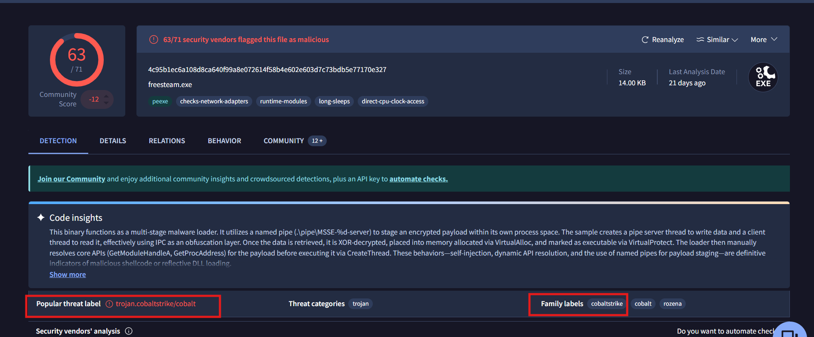
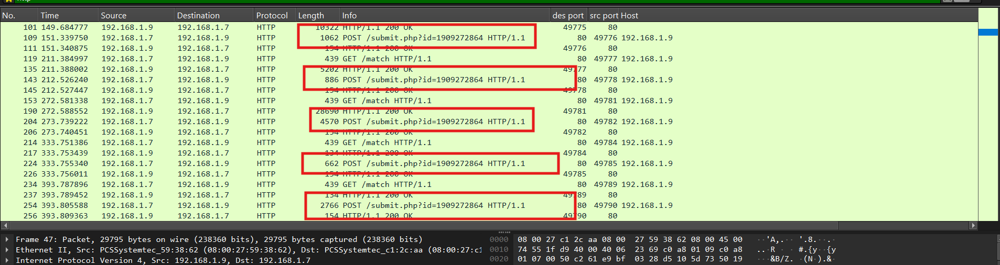
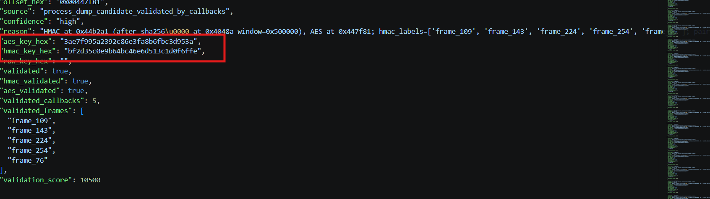
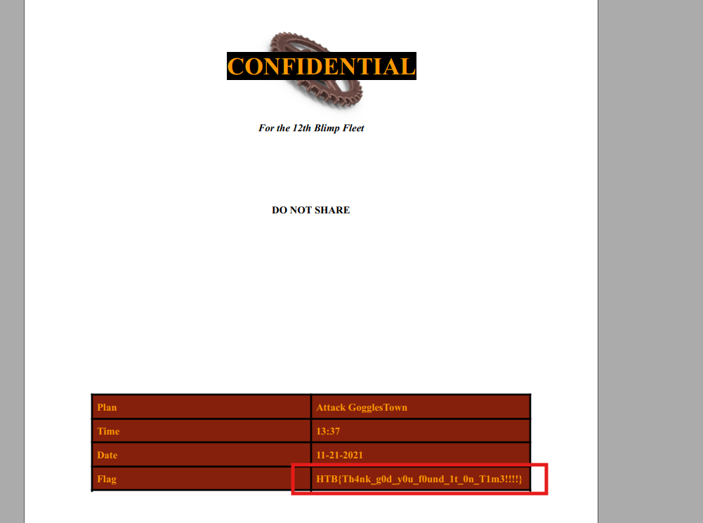
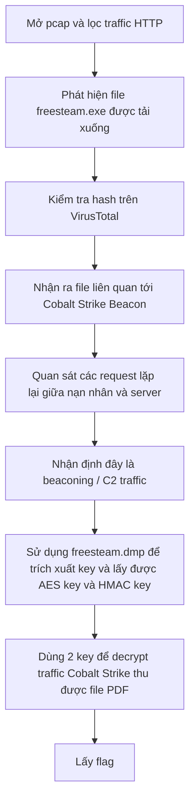

# Challenge Strike Back

## 1. Đầu vào challenge

Đi từ file `pcap` trước.



Từ đây thấy được chủ yếu chỉ có các traffic liên quan tới HTTP và có data lớn, vậy khả năng đã có các file được tải về.

Khi sử dụng filter `http` thì ngay request đầu cũng thấy được file được tải về là `freesteam.exe`.



Thử export file này trước. Sau khi tính hash và kiểm tra trên VirusTotal, kết quả cho thấy file `freesteam.exe` bị nhiều engine nhận diện phần label/family file này liên quan tới **Cobalt Strike / Cobalt Strike Beacon**.



### Kiến thức ngoài lề

**Cobalt Strike** là một framework cung cấp sẵn hệ thống C2.

Trong Cobalt Strike, payload chính thường gọi là **Beacon**. Beacon là chương trình chạy trên máy nạn nhân, nhiệm vụ là:
- gọi về C2 server
- nhận task/lệnh
- thực thi task
- gửi kết quả về server
- duy trì kết nối lâu dài

Beacon thường không nhất thiết giữ kết nối liên tục. Nó có thể tăt một lúc, rồi lại gọi về server.

Beacon có thể giao tiếp qua nhiều kênh khác nhau, ví dụ:
- HTTP / HTTPS
- DNS
- SMB
- TCP

Với HTTP Beacon, ý tưởng thường là:

- `GET` = Beacon hỏi server có task không
- `POST` = Beacon gửi dữ liệu hoặc kết quả thực thi về server

Ví dụ khái niệm:

```text
GET /abc
→ hỏi server có lệnh mới không

POST /xyz
→ gửi output hoặc dữ liệu về server
```

Nhìn ngoài thì giống web traffic bình thường, nhưng bên trong body/cookie/header có thể chứa dữ liệu C2 đã mã hóa.

**Stager** là payload nhỏ ban đầu.

Thay vì thả ngay payload lớn, attacker có thể dùng một đoạn nhỏ trước. Đoạn nhỏ này chỉ làm nhiệm vụ:
- kết nối tới server
- tải payload lớn hơn
- chạy payload lớn hơn trong memory

Mô hình:

```text
initial loader
   ↓
stager nhỏ
   ↓
full Beacon
   ↓
C2 communication
```

Lý do dùng stager:
- payload ban đầu nhỏ hơn
- dễ nhúng vào shellcode
- có thể tải stage mới từ server
- linh hoạt hơn

**Malleable C2** là cơ chế cho phép thay đổi hình dạng traffic C2.

Tức là operator có thể chỉnh Beacon để traffic nhìn giống một loại web traffic nào đó.

Có thể chỉnh các thứ như:
- URI path
- User-Agent
- HTTP header
- Cookie
- cách đặt dữ liệu trong request
- thời gian sleep
- pattern GET/POST

---

## 2. Nhận diện dấu hiệu beaconing



Đồng thời dấu hiệu C2 còn được thấy rõ qua các request lặp lại.

Các request này xuất hiện nhiều lần giữa máy nạn nhân `192.168.1.7` và server `192.168.1.9`. Kiểu giao tiếp này khá giống beaconing: payload trên máy nạn nhân định kỳ gửi request về C2 để hỏi task mới, sau đó dùng `POST` để gửi dữ liệu hoặc kết quả thực thi về server.

Được biết khi attacker sử dụng C2 như Cobalt Strike Beacon, dữ liệu trao đổi giữa Beacon và Server thường không ở dạng plaintext. Các task, metadata, output hoặc file data thường được mã hóa trước khi gửi qua HTTP. Vì vậy nếu chỉ nhìn PCAP thông thường thì ta chỉ thấy các request GET/POST, còn nội dung thật bên trong không đọc được trực tiếp.

Kèm theo đó challenge còn cung cấp `freesteam.dmp`, đây là memory dump của process liên quan. Với các Beacon chạy trong memory, dump này có thể chứa config hoặc key dùng để giải mã traffic C2.

---

## 3. Trích xuất key từ process dump

Sử dụng tool để extract ra **AES key** và **HMAC key** của Cobalt Strike Beacon.

```bash
havoc-pcap-parser   --pcap "capture.pcap"   --out "key"   --decrypt   --decrypt-family cobalt-strike   --cs-process-dump "freesteam.dmp"   --cs-extract-keys   --cs-callback-source body   --cs-transform raw   --cs-min-valid-callbacks 3
```

Cuối cùng thu được **AES key** và **HMAC key** hợp lệ:



```text
AES  = 3ae7f995a2392c86e3fa8b6fbc3d953a
HMAC = bf2d35c0e9b64bc46e6d513c1d0f6ffe
```

---

## 4. Giải mã traffic Cobalt Strike

Tiếp tục truyền 2 key vừa lấy được để decrypt traffic Cobalt Strike.

```bash
havoc-pcap-parser   --pcap capture.pcap   --out decrypt   --decrypt   --decrypt-family cobalt-strike   --cs-aes-key 3ae7f995a2392c86e3fa8b6fbc3d953a   --cs-hmac-key bf2d35c0e9b64bc46e6d513c1d0f6ffe   --ctf   --extract   --max-payload-bytes 20000000
```

Cuối cùng decrypt ra được file PDF chứa flag.



---

## 5. Flag

```text
HTB{Th4nk_g0d_y0u_f0und_1t_0n_T1m3!!!!}
```

---

## 6. Flow


