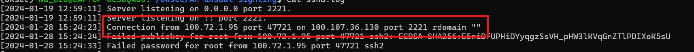
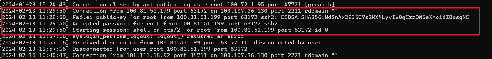
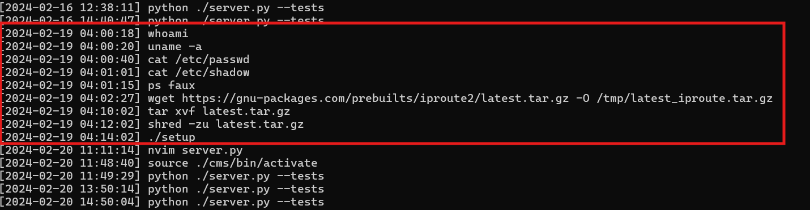
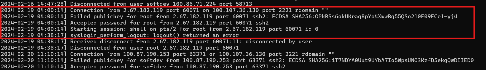
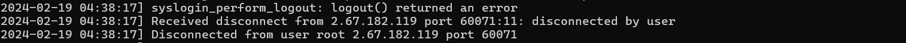

# Challenge An unsual sighting

## Flag: HTB{4n_unusual_s1ght1ng_1n_SSH_l0gs!}

## 1. Mô tả challenge

Challenge cung cấp 1 file zip và khi extract thu được 2 file gồm:

- `bash_history.txt`
- `sshd.log`

Nhiệm vụ là trả lời các câu hỏi dựa trên nội dung từ 2 file này.

---

## 2. Câu hỏi và lời giải

### Câu hỏi 1. SSH Server IP:PORT

Từ file `sshd.log` thấy được các log kiểu:

```text
Connection from 100.81.51.199 port 63172 on 100.107.36.130 port 2221
```


Trong đó:

- `from 100.81.51.199 port 63172` là máy của user đang kết nối vào
- `on 100.107.36.130 port 2221` là SSH của máy chủ đích

**Đáp án:** `100.107.36.130:2221`

---

### Câu hỏi 2. First successful login

Vẫn từ file `sshd.log` thấy được lần đăng nhập thành công đầu tiên.


**Đáp án:** `2024-02-13 11:29:50`

---

### Câu hỏi 3. Unusual login time

Với câu hỏi này không đi mò đáp án từ file `sshd.log` trước mà mò theo hành động trong file `bash_history.txt` trước.

Có những lệnh khả nghi root, phiên đó chạy các lệnh lạ như:

- `whoami`
- `cat /etc/passwd`

Đồng thời còn cố gắng tải 1 file tar lạ.


Truy ngược về file `sshd.log` thấy 1 phiên đăng nhập thành công vào tầm giờ đó.


**Đáp án:** `2024-02-19 04:00:14`

---

### Câu hỏi 4. Attacker public key fingerprint

Như log trên dễ thấy public key fingerprint của attacker đưa cho phía server là:

```text
OPkBSs6okUKraq8pYo4XwwBg55QSo210F09FCe1-yj4
```


#### Giải thích ngoài lề

Fingerprint là chuỗi rút gọn để nhận diện 1 SSH key, thay vì lưu 1 public key dài thì log thường lưu 1 giá trị băm ngắn.

**Đáp án:** `OPkBSs6okUKraq8pYo4XwwBg55QSo210F09FCe1-yj4`

---

### Câu hỏi 5. First command attacker executed

Như xác định trên xác định được thời gian đăng nhập attacker, và các command mà attacker chạy thì thấy lệnh `whoami` chạy đầu tiên.

**Đáp án:** `whoaim`

---

### Câu hỏi 6. Final command attacker executed before logout

Đối chiếu từ thời gian logout và `Disconnected` thấy:


Truy ngược lên file `sshd.log` thấy được trước khoảng thời gian đó lệnh cuối được thực hiện là:

```text
./setup
```


**Đáp án:** `./setup`

---

## 3. Đáp án

| Câu hỏi | Đáp án |
|---|---|
| SSH Server IP:PORT | `100.107.36.130:2221` |
| First successful login | `2024-02-13 11:29:50` |
| Unusual login time | `2024-02-19 04:00:14` |
| Attacker public key fingerprint | `OPkBSs6okUKraq8pYo4XwwBg55QSo210F09FCe1-yj4` |
| First command attacker executed | `whoaim` |
| Final command attacker executed before logout | `./setup` |

---

## 4. Nhận xét 

Bài này chủ yếu dựa vào việc đối chiếu giữa:

- log xác thực trong `sshd.log`
- lịch sử lệnh trong `bash_history.txt`

Từ đó lần ra:

- máy chủ SSH đích
- thời điểm đăng nhập đầu tiên
- thời điểm đăng nhập bất thường
- fingerprint của key attacker
- lệnh đầu tiên và lệnh cuối mà attacker thực hiện
