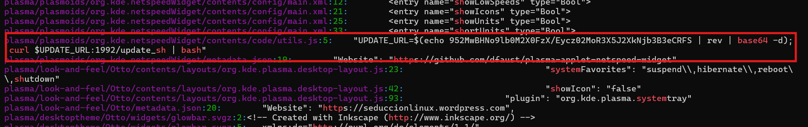
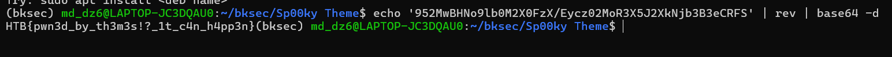

# Challenge Sp00ky Theme

## 1. Đầu vào challenge

Challenge đầu vào cho 1 folder **Sp00ky Theme** chứa rất nhiều folder và file con.

Vì đây là một theme nên bên trong chứa khá nhiều loại file như:

- `svgz`
- `qml`
- `js`
- file cấu hình
- các asset giao diện

Vì vậy, bước đầu tiên là dùng `grep` để sàng lọc các chuỗi hoặc hành vi đáng ngờ.

```bash
grep -RInE 'http|curl|wget|exec|run|system|bash|sh|base64'
```

---

## 2. Kết quả ban đầu

Sau khi thực hiện command trên, phát hiện được **một đoạn Base64 lạ**.



---

## 3. Giải thích

Chuỗi này được:

1. Đảo ngược bằng rev rồi decode base64
2. Rồi dùng trong url để curl nội dung về 
3. Rồi thực hiện ngay bằng `bash`


khi thử đảo ngược chuỗi rồi decode base64 thì nhận được flag



---

## 5. Flag

```text
HTB{pwn3d_by_th3m3s!?_1t_c4n_h4pp3n}
```
